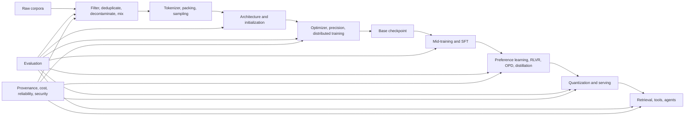

# Developing large language models: a deep interview tutorial

**Edition:** 2.0, updated 2026-08-24  
**Study window:** 2026-08-24 through 2026-12-31  
**Marin snapshot:** commit `e7c34f396f8f2780fc76bb60bcb7263900540534`  
**Target:** research engineer, model-training engineer, post-training engineer, inference engineer, or applied LLM engineer interviews  
**Assumption:** you want to understand how models are developed; you do not intend to reproduce a frontier run locally.

This technical tutorial uses [Stanford CS336](https://cs336.stanford.edu/) for durable foundations, the supplied [Scientific Spaces + SOTA reading guide](https://github.com/voe09/codingmachine/blob/main/hc/spaces-ac-llm-reading-guide.md) for its architecture and post-training branches, and Marin as a public case study in model development. The supplied guide and the current sections below were checked through 2026-08-24.

## What changed in this edition

The first edition was a syllabus with short topic summaries. This edition adds the depth an interview requires:

- derivations for cross-entropy, attention, RoPE, MoE routing, scaling-law comparisons, DPO, and policy-gradient objectives;
- tensor shapes, parameter counts, FLOPs, memory traffic, communication, and latency models;
- implementation invariants and bugs that make apparently correct experiments invalid;
- current post-training systems: GRPO-family mechanics, DAPO and GSPO as branches, SDPO and on-policy distillation, asynchronous rollouts, policy staleness, and verifier gaming;
- current serving: prefill/decode separation, disaggregation, KV transfer and tiering, MoE imbalance, FP4, and tail latency;
- current evaluation: infrastructure-clean gates, live benchmarks, search-time contamination, long-horizon tasks, and trajectory analysis;
- current architecture: Attention Residuals, hybrid linear/global attention, very sparse MoE, native multimodality, and diffusion language models;
- Marin development traces that connect a hypothesis to code, a scaling gate, a failed run, a decision, and a launch contract.

## How to read claims without getting outdated

Every important idea belongs to one of three classes:

- **Foundation** means the mechanism is durable even if the canonical paper is old. Softmax attention and maximum likelihood are not stale because newer model reports exist.
- **Current practice** means multiple 2025-2026 systems use the idea or production infrastructure depends on it. Details remain hardware- and workload-dependent.
- **Frontier experiment** means a recent paper or model report gives credible evidence, but the result is not yet a universal default.

Do not memorize a 2026 model's brand-name recipe. Learn the invariant question it answers. Kimi Delta Attention is one answer to sequence-state cost; Attention Residuals are one answer to across-depth information access; DAPO and GSPO are answers to policy-update instability; disaggregated serving is an answer to incompatible prefill and decode resource profiles.

## The model-development map



The developer's unit of progress changes by layer. Pretraining asks for capability per training FLOP and per wall-clock dollar. Post-training asks for target behavior without unacceptable regressions. Serving asks for quality under latency, throughput, memory, and cost constraints. An agent product asks for task success under bounded authority. Start every design answer by naming the layer and its objective.

## The interview standard

For each topic, reach four levels:

1. **Mechanism:** write the objective or algorithm and explain every term.
2. **Accounting:** derive shapes, parameters, compute, memory, communication, or sample cost.
3. **Failure analysis:** identify what can make a metric misleading or a run unstable.
4. **Decision:** choose a design under constraints and state the experiment that could prove you wrong.

Recognition is not mastery. If you can say that GQA saves KV memory but cannot calculate the saving or describe a quality-risk test, expect follow-up questions to expose the gap.

---

# Part I — Model foundations

## 1. Language modeling, loss, and tokenization

### 1.1 Autoregressive modeling

For tokens \(x_{1:T}\), the chain rule gives

\[
p_\theta(x_{1:T})=\prod_{t=1}^{T}p_\theta(x_t\mid x_{<t}).
\]

Teacher-forced maximum likelihood minimizes

\[
\mathcal L_{\mathrm{NLL}}
=-\frac{1}{\sum_t m_t}\sum_{t=1}^{T}m_t\log p_\theta(x_t\mid x_{<t}),
\]

where \(m_t\in\{0,1\}\) masks padding, prompt tokens in response-only SFT, or document-boundary positions that should not contribute. The input at position \(t\) predicts token \(t+1\); a one-token shift bug trains the wrong conditional distribution while producing plausible loss values.

If logits are \(z\in\mathbb R^V\), probabilities are \(p_i=\exp z_i/\sum_j\exp z_j\). For one-hot target \(y\),

\[
\ell=-\sum_i y_i\log p_i,
\qquad
\frac{\partial \ell}{\partial z_i}=p_i-y_i.
\]

This gradient explains why cross-entropy both raises the target logit and lowers competitors. Compute log-softmax with log-sum-exp,

\[
\log\sum_j e^{z_j}=a+\log\sum_j e^{z_j-a},\quad a=\max_j z_j,
\]

or large logits overflow. A fused cross-entropy kernel must preserve this stabilization and accumulate reductions at adequate precision.

Perplexity is \(\exp(\mathcal L_{\mathrm{NLL}})\). It is comparable only under compatible tokenization and text. For tokenizer-independent comparison, use bits per byte:

\[
\mathrm{BPB}=\frac{-\sum_t\log_2 p(x_t\mid x_{<t})}{\text{number of source bytes}}.
\]

**Implementation invariants**

- Ignore padding in both numerator and denominator. Averaging per batch and then averaging batches biases results when token counts differ.
- Reset or mask attention across packed document boundaries unless cross-document context is intentional.
- Log loss by source/domain and position, not only the global mean. A mixture can improve while a critical domain regresses.
- Record tokenizer hash, normalization rules, special-token IDs, vocabulary, and chat template with the checkpoint.
- For distributed loss, all-reduce the summed loss and token count, then divide. Do not average already-averaged local losses with unequal valid-token counts.

### 1.2 Tokenization is part of the model

BPE begins with primitive symbols and repeatedly merges the adjacent pair with greatest corpus frequency. At inference, the learned ordered merges deterministically segment text. A larger vocabulary usually shortens sequences but enlarges the embedding/output matrices and increases the output softmax cost. It can also waste capacity on rare whole strings.

For vocabulary \(V\) and width \(d\), untied input and output tables cost \(2Vd\) parameters; tied weights cost \(Vd\). Shorter tokenized sequences reduce attention and MLP work, so vocabulary choice is a systems decision as well as a linguistic one.

Measure a tokenizer on:

- bytes per token and tokens per document by language and domain;
- number, whitespace, source-code, emoji, and malformed-Unicode behavior;
- fertility disparity across languages;
- boundary behavior for identifiers and mathematical expressions;
- downstream quality at equal raw bytes and equal training FLOPs;
- end-to-end throughput, including embedding and softmax.

Byte-level or dynamically patched models remove the out-of-vocabulary problem but increase primitive sequence length or add a learned segmentation problem. Treat [Byte Latent Transformer](https://arxiv.org/abs/2412.09871) as an architecture branch after mastering subword tokenization, not as a replacement for understanding BPE.

### 1.3 What to build

Implement BPE training/encoding and a stable cross-entropy in a few hundred lines. Unit-test Unicode round trips, reserved tokens, deterministic merges, masking, and the gradient against a library. Then inspect Marin's [`experiments/marin_tokenizer.py`](https://github.com/marin-community/marin/blob/e7c34f396f8f2780fc76bb60bcb7263900540534/experiments/marin_tokenizer.py) and [`lib/levanter/src/levanter/tokenizers.py`](https://github.com/marin-community/marin/blob/e7c34f396f8f2780fc76bb60bcb7263900540534/lib/levanter/src/levanter/tokenizers.py). Your artifact is a tokenizer report comparing English, Chinese, code, numbers, and whitespace by bytes/token and estimated training FLOPs.

### 1.4 Interview drill

**Question:** Two models report perplexities 8 and 10. Is the first better?  
**Strong answer:** ask whether evaluation bytes, tokenizers, normalization, boundary masking, and weighting match; compare NLL per byte if they do not; then inspect domain slices and uncertainty.

---

## 2. The decoder Transformer from shapes to cost

### 2.1 One pre-norm block

Let \(X\in\mathbb R^{B\times T\times d}\). A common block is

\[
U=X+\mathrm{Attention}(\mathrm{RMSNorm}(X)),
\]

\[
Y=U+\mathrm{SwiGLU}(\mathrm{RMSNorm}(U)).
\]

RMSNorm computes

\[
\mathrm{RMSNorm}(x)=g\odot\frac{x}{\sqrt{\frac1d\sum_i x_i^2+\epsilon}}.
\]

It controls scale without mean subtraction. Pre-norm gives gradients a short identity path through residual connections, making deep optimization easier than the original post-norm form.

For \(H_q\) query heads, \(H_{kv}\) KV heads, and head dimension \(d_h=d/H_q\):

\[
Q=XW_Q\in\mathbb R^{B\times T\times H_q\times d_h},
\]

\[
K,V\in\mathbb R^{B\times T\times H_{kv}\times d_h}.
\]

For a query head \(h\), map it to KV head \(g(h)\):

\[
A_h=\operatorname{softmax}\left(\frac{Q_hK_{g(h)}^\top}{\sqrt{d_h}}+M\right),
\quad O_h=A_hV_{g(h)}.
\]

The causal mask \(M_{ij}=0\) for \(j\le i\) and \(-\infty\) otherwise. Multi-head attention has \(H_{kv}=H_q\); multi-query attention has \(H_{kv}=1\); grouped-query attention lies between. GQA reduces KV projection parameters and serving KV memory while keeping several KV subspaces.

SwiGLU is commonly

\[
\mathrm{SwiGLU}(x)=W_2\left(\operatorname{SiLU}(W_gx)\odot W_ux\right).
\]

If the intermediate width is \(d_{ff}\), its three matrices contain about \(3dd_{ff}\) parameters.

### 2.2 Parameter and FLOP accounting

Ignoring biases and norms, attention projections contain

\[
N_{attn}=d(H_qd_h)+2d(H_{kv}d_h)+d(H_qd_h).
\]

For MHA this is \(4d^2\). For GQA it is \(2d^2+2dd_{kv}\), where \(d_{kv}=H_{kv}d_h\). A SwiGLU MLP has \(3dd_{ff}\). With \(d_{ff}\approx 8d/3\), it is about \(8d^2\), so a dense block is near \(12d^2\) parameters.

For one forward sequence, each matrix parameter participates in roughly \(2T\) FLOPs from multiply-adds. Attention score and value products add approximately

\[
4BT^2H_qd_h=4BT^2d
\]

FLOPs per layer. Thus linear layers dominate for \(T\ll dL\), while quadratic attention becomes dominant at long context. Training forward plus backward is often estimated as \(6ND\) for \(N\) non-embedding parameters and \(D\) tokens, but attention, embeddings, sparsity, recomputation, and kernel efficiency alter the constant. State the approximation.

**Worked shape check:** with \(B=8,T=4096,d=4096,H_q=32,H_{kv}=8,d_h=128\), Q has \(8\cdot4096\cdot32\cdot128\) elements; each K and V has one quarter as many. During autoregressive serving, this head ratio gives a fourfold KV-cache reduction relative to MHA, all else equal.

### 2.3 FlashAttention changes memory traffic, not the function

Materializing \(A\in\mathbb R^{B\times H\times T\times T}\) is expensive. [FlashAttention](https://arxiv.org/abs/2205.14135) tiles Q, K, and V through fast on-chip memory and uses online softmax statistics. It computes exact attention up to floating-point order while avoiding the full score matrix in HBM.

For each query row, maintain running maximum \(m\), normalizer \(\ell\), and output accumulator \(o\). When a new key block yields scores \(s\), update the maximum \(m'\), rescale the old accumulator by \(e^{m-m'}\), and add the new block. The invariant is that \(o/\ell\) equals the softmax-weighted value over all processed blocks. This is the interview-level explanation of why tiling can be exact.

Kernel performance depends on tile sizes, mask type, sequence lengths, head dimension, dtype, and backward recomputation. A higher theoretical FLOP count can run faster if it maps better to hardware. Read Marin's [`experiments/benchmarks/fa4/tile_sweep.py`](https://github.com/marin-community/marin/blob/e7c34f396f8f2780fc76bb60bcb7263900540534/experiments/benchmarks/fa4/tile_sweep.py) as an example of correctness plus measured gating.

### 2.4 RoPE from rotations

For each two-dimensional feature pair and angular frequency \(\omega_i\), Rotary Position Embedding applies

\[
R(t\omega_i)=
\begin{bmatrix}
\cos(t\omega_i)&-\sin(t\omega_i)\\
\sin(t\omega_i)&\cos(t\omega_i)
\end{bmatrix}.
\]

Queries and keys become \(q_t'=R(t)q_t\), \(k_s'=R(s)k_s\). Since rotations are orthogonal and \(R(t)^TR(s)=R(s-t)\),

\[
(q_t')^Tk_s'=q_t^TR(s-t)k_s.
\]

The attention score therefore contains relative-position structure even though rotations use absolute indices. Frequencies are typically geometric across dimensions. Extrapolation beyond training length fails when phase patterns enter unseen regimes or high-frequency dimensions rotate too quickly. Interpolation, base-frequency changes, partial RoPE, long-context continued training, and attention variants address different pieces; none makes a model reason effectively over arbitrary length by configuration alone.

Test long context across at least four axes: retrieval at varied depth, aggregation over many facts, algorithmic state tracking, and realistic agent trajectories. Control for prompt length, answer location, distractor density, and training contamination.

### 2.5 Efficient attention beyond fewer KV heads

GQA compresses KV heads but retains full softmax attention over positions. Other methods change the sequence computation.

**Windowed and block-sparse attention.** If each token attends to a window of \(w\) rather than all \(T\) positions, score work and state reads scale as \(O(Tw)\) instead of \(O(T^2)\). Periodic global layers, global tokens, dilated blocks, or retrieval routes restore long-range paths. Information may need several layers to cross the sequence, so receptive field and effective path length matter. Block sparsity must align with kernels; an irregular mask with fewer mathematical pairs can run slower than dense tiled attention.

**Kernelized linear attention.** Suppose similarity factorizes as

\[
\kappa(q,k)=\phi(q)^T\phi(k).
\]

For causal attention, maintain

\[
S_t=S_{t-1}+\phi(k_t)v_t^T,\qquad
z_t=z_{t-1}+\phi(k_t).
\]

Then

\[
o_t=\frac{\phi(q_t)^TS_t}{\phi(q_t)^Tz_t+\epsilon}.
\]

The recurrent state size depends on feature dimension rather than context length. Exact softmax's exponential dot-product kernel has no finite exact feature map, so practical methods approximate it or learn a different recurrence. Quality can fail through limited state capacity, recency bias, or unstable normalization.

**Gated delta recurrence.** A delta-rule memory writes the residual between a new value and what the current memory predicts:

\[
S_t=G_t\odot S_{t-1}
+\beta_t\left(v_t-S_{t-1}k_t\right)k_t^T,
\]

with normalized/key-transformed \(k_t\), write strength \(\beta_t\), and scalar, channel-wise, or structured decay \(G_t\). This can overwrite stale associations instead of only accumulating outer products. Parallel training requires a chunkwise scan or specialized kernel; recurrent decode is cheap. The exact Kimi Delta Attention form is more specialized, but this equation gives the mechanism to understand it.

**Latent KV compression.** Multi-head latent attention projects each token to a lower-dimensional latent \(c_t=W_Dh_t\) and reconstructs key/value features with learned up-projections, often keeping a separate positional component. Decode can cache \(c_t\) rather than every head's full K and V. Some projection products can be algebraically absorbed into query/output transforms to avoid explicit reconstruction. The tradeoff is a learned information bottleneck and more specialized kernels.

**Learned sparse KV selection.** A selector retrieves only likely relevant past states. It saves attention/KV reads only if selection is cheaper than full attention and recall remains high. Measure selector overhead, physical KV retained, worst-case retrieval failure, and quality on aggregation—not just a needle task. June 2026 [FlashMemory](https://arxiv.org/abs/2606.09079) is one current frontier example; its compression numbers remain paper-specific.

Kimi K3 reports a 3:1 hybrid of recurrent Kimi Delta Attention and gated global latent attention. The transferable design principle is hybridization: use cheap recurrent/local layers for most token mixing and periodic global layers to repair long-range access. Validate the ratio by scaling and hardware measurements.

### 2.6 Architecture families and initialization

An encoder uses bidirectional attention and suits embeddings, classification, and masked/contrastive objectives. An encoder-decoder model gives the encoder bidirectional input context and lets an autoregressive decoder cross-attend to it; it remains natural for conditional generation with a clear source/target split. A decoder-only model represents prompt and output in one causal stream, making next-token pretraining, in-context learning, and serving simple. Choose from input-output structure and workload, not fashion.

Initialization controls signal scale before the optimizer can correct it. Matrix weights are commonly zero-mean with variance chosen from fan-in; residual-output projections may receive an additional depth-dependent scale such as \(1/\sqrt{2L}\). Norm scales often start at one, biases at zero, and embedding/output weights may be tied. Exact constants interact with parameterization, width, depth, optimizer, and residual gates.

The invariants are: activation RMS should remain controlled with depth; attention logits should avoid immediate saturation; update-to-weight ratios should transfer across scale; tied/shared parameters must not be initialized twice; and small-scale initialization sweeps must be tested when width/depth changes. “Use Xavier” is not a complete large-model recipe.

### 2.7 The residual stream is now an active research target

Standard residual updates force each layer to read the latest accumulated stream. [Attention Residuals](https://arxiv.org/abs/2603.15031) let a layer select from earlier depth representations, changing information flow across depth. The July 2026 [Kimi K3 report](https://arxiv.org/abs/2607.24653) combines Attention Residuals with hybrid Kimi Delta Attention/global attention. This is a **frontier experiment**, not yet a default block.

The invariant question is: which earlier information can the current layer access, at what memory/compute cost, and how does the route remain stable? Require matched-compute scaling evidence and throughput, not a single small-model loss curve. Newer variants already explore multi-head and delta residual routing, which is a warning against memorizing one named form.

### 2.8 Implementation bugs to catch

- Causal masks broadcast across the wrong axis and silently expose future tokens.
- RoPE is applied to V or applied after caching only on one path.
- GQA repeats KV tensors physically, erasing memory savings; broadcasting or a grouped kernel is needed.
- Padding and causal masks combine with the wrong sign or dtype.
- RMSNorm epsilon is too small for the compute dtype.
- Activation checkpointing changes randomness because dropout keys are not replayed.
- Fused and reference attention disagree only at ragged lengths or document boundaries because tests cover square, unpadded batches.

### 2.9 What to build and explain

Implement a single decoder block with a reference attention path. Test causality by changing a future token and asserting earlier logits do not change. Test grouped attention against explicit KV repeat. Compare gradients with and without checkpointing. Then read Marin's [`lib/levanter/src/levanter/models/flash_attention.py`](https://github.com/marin-community/marin/blob/e7c34f396f8f2780fc76bb60bcb7263900540534/lib/levanter/src/levanter/models/flash_attention.py), [`lib/levanter/src/levanter/models/llama.py`](https://github.com/marin-community/marin/blob/e7c34f396f8f2780fc76bb60bcb7263900540534/lib/levanter/src/levanter/models/llama.py), and Grug model code under [`experiments/grug`](https://github.com/marin-community/marin/tree/e7c34f396f8f2780fc76bb60bcb7263900540534/experiments/grug).

**Interview drill:** derive when attention's \(T^2\) term overtakes projection/MLP work; then explain why the crossover in wall-clock time differs from the FLOP crossover.

---

## 3. Mixture-of-Experts: capacity without proportional activation

### 3.1 Routing equations

A sparse MoE replaces some dense MLPs with \(E\) experts. For token representation \(x\), router logits are

\[
r=W_rx,\qquad p=\operatorname{softmax}(r).
\]

Let \(S(x)=\operatorname{TopK}(p,k)\). One output form is

\[
y=\sum_{e\in S(x)}\tilde p_e f_e(x),
\quad
\tilde p_e=\frac{p_e}{\sum_{j\in S(x)}p_j}.
\]

Total expert parameters scale with \(E\); active expert compute scales with \(k\). A model can therefore have enormous total capacity but much smaller active parameters per token. Report both. “2.8T model” without “104B active” is inadequate accounting.

The dispatcher groups tokens by expert, sends them to expert-owning devices, runs batched MLPs, and sends outputs back. For expert parallelism, this is typically an all-to-all pattern. The theoretical expert FLOPs ignore router work, token permutation, communication, padding, dropped tokens, and load imbalance.

### 3.2 Load balance and capacity

If a batch has \(n\) routed token-expert assignments, ideal load is \(n/E\). A fixed-capacity implementation may allocate

\[
C_e=\left\lceil \gamma\frac{n}{E}\right\rceil
\]

slots per expert, where \(\gamma\) is the capacity factor. Overflow assignments are dropped or rerouted. Large \(\gamma\) wastes compute through padding; small \(\gamma\) drops signal. Dropless routing avoids loss of assignments but creates ragged communication and stragglers.

Auxiliary load-balancing losses often couple assignment frequency and mean router probability. Router z-loss penalizes large log-sum-exp values to keep logits numerically controlled. Other schemes update routing biases outside the main gradient. Whatever the method, log:

- tokens per expert, coefficient of variation, maximum/mean load, and zero-load experts;
- dropped or rerouted fraction;
- router entropy and maximum probability;
- expert gradient and activation norms;
- dispatch, all-to-all, expert GEMM, and combine time;
- quality and throughput at each scale.

Routing is data-dependent. An average balance statistic can hide per-domain or per-sequence hotspots. At serving time, simultaneous requests can select the same experts and create dynamic stragglers even when the training corpus was balanced.

### 3.3 Effective speedup, not attractive loss

Suppose a baseline scaling law is

\[
L_b(C)=L_\infty+A_bC^{-\alpha}.
\]

A variant reaches loss \(L_v\) using compute \(C_v\). The baseline compute needed for the same loss is

\[
C_{b,eq}=\left(\frac{A_b}{L_v-L_\infty}\right)^{1/\alpha}.
\]

Its model-FLOPs speedup is \(S_C=C_{b,eq}/C_v\). If comparable runs process tokens at throughputs \(q_b\) and \(q_v\), an approximate wall-clock speedup is

\[
S_{wall}\approx S_C\frac{q_v}{q_b},
\]

after adjusting for differing FLOPs/token when needed. A finer expert configuration can improve loss yet lose decisively because all-to-all and small GEMMs cut throughput.

Marin makes this operational in [`experiments/grug/moe/agent.md`](https://github.com/marin-community/marin/blob/e7c34f396f8f2780fc76bb60bcb7263900540534/experiments/grug/moe/agent.md): a variant must show effective speedup at d512 and d768, then at d1024 and d1280, followed by a projected scaling comparison. The current report [`docs/reports/agent-moe-experiments.md`](https://github.com/marin-community/marin/blob/e7c34f396f8f2780fc76bb60bcb7263900540534/docs/reports/agent-moe-experiments.md) records both wins and failures. Finer expert granularity improved loss but produced only about 0.72-0.76x wall-clock speedup; midpoint K/V reuse passed three measured scales but its projected prefill gain still lacked a latency benchmark. This is how model development should distinguish evidence from extrapolation.

### 3.4 A dated frontier exemplar: Kimi K3

As of 2026-08-24, [Kimi K3](https://github.com/MoonshotAI/Kimi-K3) reports 2.8T total parameters, 104B active parameters, 16 of 896 routed experts, native vision, and a one-million-token context. It combines a 3:1 mix of Kimi Delta Attention and gated global attention, Attention Residuals, and Stable LatentMoE. The report attributes roughly 2.5x scaling-efficiency improvement over Kimi K2 to the combined recipe and systems work.

Treat those numbers as the authors' measured recipe claim. They do not imply that 16-of-896 routing or the same attention mix is optimal on another topology, data mixture, or scale. The transferable lessons are:

1. active and total parameters must be separated;
2. sparse scaling depends on routing stability and expert-parallel transport;
3. sequence architecture, residual architecture, MoE, precision, and hardware are co-designed;
4. million-token agentic post-training requires persistent rollout and sandbox state, not only a larger position setting.

### 3.5 Decision exercise

You have 64 GPUs with fast intra-node links and slower inter-node links. Compare a 30B dense model with a 200B-A20B MoE. Estimate active GEMM work, total weight memory, all-to-all bytes, expert placement, expected token imbalance, and failure recovery. State the batch and sequence distribution under which the MoE wins. Your acceptance gate must include quality at matched training FLOPs, tokens/s, per-expert load, drop rate, and P95 step time.

---

## 4. Optimization and numerical stability

### 4.1 AdamW precisely

For gradient \(g_t\), Adam maintains

\[
m_t=\beta_1m_{t-1}+(1-\beta_1)g_t,
\]

\[
v_t=\beta_2v_{t-1}+(1-\beta_2)g_t^2.
\]

With bias correction \(\hat m_t=m_t/(1-\beta_1^t)\), \(\hat v_t=v_t/(1-\beta_2^t)\), AdamW updates

\[
\theta_{t+1}=(1-\eta_t\lambda)\theta_t-
\eta_t\frac{\hat m_t}{\sqrt{\hat v_t}+\epsilon}.
\]

Decoupled weight decay differs from adding \(\lambda\lVert\theta\rVert^2/2\) to an adaptively scaled gradient. Exclude norm scales, biases, and sometimes embeddings from decay according to a documented parameter policy.

Global gradient clipping uses

\[
g\leftarrow g\min\left(1,\frac{c}{\lVert g\rVert_2+\epsilon}\right).
\]

It limits a symptom, not necessarily the source of instability. Per-shard norms must be squared, summed across shards, and square-rooted; clipping independently on each shard gives a different update.

Muon-style optimizers orthogonalize or normalize matrix updates and can improve parameter efficiency for certain matrix-shaped weights. They require a parameter partition: embeddings, scalars, and some projections still use Adam-like updates. The interview question is not “What is Muon?” but “Which tensors receive which geometry, how is distributed orthogonalization implemented, and did its quality gain exceed its optimizer cost?” Marin's experiment report shows MuonH could improve measured speed while a four-point fit slightly worsened the longest projection—another reason to keep scaling and throughput separate.

### 4.2 Learning-rate and batch reasoning

Warmup prevents a large effective step before moments and activation scales settle. Decay allocates smaller updates late in training. Batch size reduces gradient variance until returns diminish; larger batches need fewer optimizer steps for a fixed token budget and may change the optimal learning rate, \(\beta_2\), and data-order behavior.

Track update-to-weight ratio by parameter group:

\[
\mathrm{UWR}_l=\frac{\lVert\Delta\theta_l\rVert_2}{\lVert\theta_l\rVert_2+\epsilon}.
\]

Also track Q/K norms, attention logits, residual RMS, expert loads, gradient norms, loss by domain, non-finite values, skipped steps, and optimizer-state statistics. A single global loss curve is late and ambiguous telemetry.

### 4.3 Precision is a recipe

Mixed precision separates at least four choices: parameter storage, GEMM inputs, accumulation, and optimizer state. BF16 has FP32-like exponent range with fewer mantissa bits; FP16 has more precision near one but a narrower range. FP8 and FP4 require scaling because their representable sets are much smaller.

For a block \(x\), quantization can be written

\[
q=Q(x/s),\qquad \hat x=sq,
\]

where scale \(s\) is per tensor, channel, or small block. Quantization error depends on block outliers, scale granularity, rounding, and format. Stochastic rounding makes the rounding error approximately unbiased: values between representable neighbors are rounded up with probability proportional to distance.

The June 2026 [NVFP4 MaxText recipe](https://developer.nvidia.com/blog/train-models-faster-with-jax-and-maxtext-using-nvfp4-on-nvidia-blackwell/) uses 16-value micro-block scaling, higher-precision scale factors, selective Hadamard transforms for gradient inputs, two-dimensional weight scaling, stochastic rounding, and selective higher-precision paths. Its reported speedups are Blackwell-specific; attention remains at higher precision in that recipe because softmax can amplify quantization noise. [Transformer Engine's precision guide](https://docs.nvidia.com/deeplearning/transformer-engine/user-guide/examples/fp8_primer.html) is the implementation reference.

Ask five questions before accepting “FP4 works”:

1. Which tensors and phases are FP4?
2. What scale granularity and update rule are used?
3. Where are accumulation and optimizer state kept?
4. Which layers or operations escape to higher precision?
5. Is convergence matched through the full token budget and downstream evaluation, or only for a short run?

### 4.4 Loss-spike diagnosis from Marin

Marin's [`docs/reports/marin-32b-retro.md`](https://github.com/marin-community/marin/blob/e7c34f396f8f2780fc76bb60bcb7263900540534/docs/reports/marin-32b-retro.md) is a stronger lesson than a clean training recipe. At 32B, update clipping, stricter gradient clipping, step skipping, and optimizer-state reconstruction softened spikes but did not eliminate them. Switching to a QK-Norm architecture imposed a temporary loss penalty, recovered in roughly 10B tokens, and removed the recurring spikes. Later, cached GSM8K contamination and a cheap linear permutation created separate evaluation and data-order pathologies; a Feistel shuffle and cleaner mix fixed them.

Build a fault tree before changing the model:

- **data:** corrupt shard, length burst, repeated/correlated samples, mixture phase shift;
- **numerics:** overflow, low-precision scale saturation, fused-kernel mismatch;
- **optimization:** update outlier, bad schedule boundary, stale or corrupt state;
- **architecture:** QK/logit growth, residual-scale drift, router collapse;
- **distributed system:** one rank diverges, collective corruption, partial checkpoint;
- **measurement:** logging aggregation bug or evaluation mismatch.

Localize with replay from the last good checkpoint, exact batch capture, reference kernels, precision escalation, per-rank comparisons, and one-variable restarts. A mitigation that lets training continue is not a root-cause result.

### 4.5 Interview drill

**Question:** Loss spikes after 70k steps, always following a large update norm. Should you lower the learning rate?  
**Strong answer:** lowering LR is one hypothesis. First preserve state and triggering batches, verify all ranks, inspect QK/logit and per-layer update norms, replay with reference/high-precision kernels, test data order, and compare architectural normalization. Pre-register what evidence would distinguish transient bad data, numerical failure, optimizer state, and structural instability.

---

# Part II — Data, scaling, and distributed training

## 5. Pretraining data is an optimization variable

### 5.1 The pipeline and its invariants

A serious data pipeline has explicit stages:

1. snapshot sources with licenses, timestamps, and immutable identifiers;
2. parse and normalize while preserving document boundaries and metadata;
3. remove exact duplicates, then near duplicates at document and span level;
4. classify language, domain, quality, safety, and personally identifying content;
5. decontaminate evaluation sets before tokenization and cache the evidence;
6. assign mixture weights, sampling temperature, and repeat limits;
7. tokenize, pack, shard, checksum, and publish a versioned manifest;
8. inspect sampled batches from the exact artifact used by training.

The unit of deduplication matters. Document-only dedup leaves boilerplate spans; aggressive span dedup can remove legitimate repeated structure such as code licenses or mathematical definitions. Thresholds trade recall against false positives. Measure retained bytes by source/domain and manually audit boundary cases.

Decontamination is also a lineage problem. Marin's 32B retrospective found that corrected preprocessing did not remove a contaminated dataset already cached on the cluster. A config diff was insufficient because the resolved artifact was stale. The invariant is: the training record must include the content-addressed artifact and decontamination manifest, not only source code.

### 5.2 Mixture weights are gradient weights

If domain \(i\) is sampled with probability \(w_i\), the expected gradient is

\[
\mathbb E[g]=\sum_i w_i\,\mathbb E_{x\sim D_i}[\nabla_\theta\ell(x)].
\]

Changing \(w_i\) changes the optimization target. Dataset size alone is not an optimal weight: small, high-quality code or math sets may deserve oversampling, but repeated epochs raise memorization and overfitting risks. Track effective epochs and unique-token exposure per source.

A mixture experiment must hold model, tokenizer, token budget, optimizer, schedule, and evaluation harness fixed. Evaluate held-out loss by domain plus downstream capabilities. Global loss can hide tradeoffs; zero-shot task scores can regress while linear probes or domain loss improve. The 2026 [MarinDNA report](https://openathena.ai/blog/marin-dna/) is a current example of balanced mixture design, hyperparameter transfer from 25M to 1B models, and conflicting evaluation signals under data constraints.

Data quality belongs inside scaling models rather than as a binary label. Current 2026 work on [scaling with data quality](https://proceedings.iclr.cc/paper_files/paper/2026/hash/d0c80a0c294a16190c8904b9809c5fba-Abstract-Conference.html), [mixtures under data constraints](https://arxiv.org/abs/2605.12715), and [repeated-data scaling](https://arxiv.org/abs/2606.06888) reinforces a practical point: laws fit on one mixture and repeat regime need not transfer to another.

### 5.3 Packing and shuffling

Packing improves utilization by filling fixed-length sequences with several documents. Record segment IDs or block-diagonal masks if documents must not attend across boundaries. Decide whether end-of-document predicts the next document start; accidental cross-document attention changes the objective.

A shuffle must be reproducible, sufficiently mixing, and cheap at scale. A full random permutation is expensive to store; stateless permutations are attractive but can create correlation when the source order has structure. Marin's cheap linear permutation produced phases in the training data. The replacement Feistel permutation improved mixing while keeping random access. Evaluate shuffling through source autocorrelation by step, batch-domain entropy, repeated-neighbor rates, and loss phase changes—not only by whether every index occurs once.

### 5.4 Data interview artifact

Write a dataset card containing lineage, licensing assumptions, filters, dedup thresholds, quality distributions, contamination tests, tokenizer version, mixture weights, effective epochs, packing semantics, shuffle algorithm, known gaps, and ablations. Trace Marin's dataset registration patterns under [`experiments/datasets`](https://github.com/marin-community/marin/tree/e7c34f396f8f2780fc76bb60bcb7263900540534/experiments/datasets) and artifact guidance in [`experiments/AGENTS.md`](https://github.com/marin-community/marin/blob/e7c34f396f8f2780fc76bb60bcb7263900540534/experiments/AGENTS.md).

**Interview drill:** a curated corpus lowers validation loss but reduces code pass rate. Give at least five hypotheses and a matched experiment that separates mixture shift, tokenization, contamination, eval noise, and true capability tradeoff.

---

## 6. Scaling laws and experiment design

### 6.1 What a scaling law can and cannot do

A common empirical form is

\[
L(C)=L_\infty+AC^{-\alpha},
\]

where \(C\) is training compute. Separate laws can model parameter and data limits:

\[
L(N,D)=L_\infty+A_NN^{-\alpha}+A_DD^{-\beta}.
\]

Under a dense-compute approximation \(C\approx6ND\), optimize \(N\) and \(D\) subject to the budget. In practice, architecture, data quality, repeated data, sequence length, batch, learning rate, and hardware efficiency change the fit. A law is conditional on a recipe, not a law of nature.

An iso-FLOP sweep holds \(C\) fixed and varies model size. Because \(D\approx C/(6N)\), small models see more tokens and large models fewer. Plot final held-out loss versus size; the U-curve minimum estimates the compute-optimal allocation. Repeat at several budgets, then fit how optimal \(N^*(C)\), \(D^*(C)\), learning rate, and loss scale.

### 6.2 Correct experimental procedure

1. Define the target metric and compute accounting before launch.
2. Choose scales that make a projected difference identifiable.
3. Sweep learning rate at more than one width; a bad LR law can make an architecture look bad.
4. Use multiple seeds where variance is material.
5. Fit only completed, valid cells; record divergence as evidence rather than silently dropping it.
6. Hold out one or more larger compute budgets from fitting.
7. Report residuals, confidence intervals, sensitivity to \(L_\infty\), and alternative fit forms.
8. Measure throughput on the intended topology and convert quality gain into wall-clock gain.
9. Promote only after matched larger-scale confirmation.

Never fit and “validate” on the same points. Do not extrapolate hundreds of times from a narrow range without a held-out scale. Marin's [Delphi scaling report](https://openathena.ai/blog/delphi/) describes seven fitted iso-FLOP optima from \(3\times10^{18}\) to \(3\times10^{20}\), larger held-out budgets through \(10^{23}\), and a final extrapolation. The valuable practice is the held-out test and error accounting, not the impressive extrapolation multiple.

### 6.3 Reading a current Marin sweep

[Issue #8003](https://github.com/marin-community/marin/issues/8003) is an August 2026 MoE iso-FLOP sweep. Its first substantial update had 17 of 24 cells complete. Lower budgets showed clean U-curves, while two \(3\times10^{19}\) cells diverged from output-projection collapse and higher-budget cells remained incomplete or capacity-gated. The interim laws were explicitly provisional.

This issue teaches several development traits:

- an incomplete sweep can guide scheduling but should not be presented as a finished law;
- divergence location is architecture/numerics evidence;
- capacity availability changes the experiment matrix and therefore the certainty;
- learning-rate transfer is itself a tested hypothesis;
- stopping obsolete cells is rational after the decision boundary changes, provided the decision is recorded.

### 6.4 Statistics for model experiments

For paired evaluation outcomes \(d_i\), estimate \(\bar d\) and use paired bootstrap resampling over examples. Pairing removes example-difficulty variance. For binary accuracy with \(n\) independent items, a rough standard error is \(\sqrt{p(1-p)/n}\); use Wilson intervals rather than a normal interval near 0 or 1. Multiple benchmark comparisons inflate false positives, so predeclare a primary metric and report the full regression panel.

For training curves, neighboring checkpoints and batches are autocorrelated. Treating every logged step as an independent sample produces absurdly narrow intervals. Compare replicate runs or use block/bootstrap methods consistent with the dependence structure.

### 6.5 Interview exercise

Design a \(30\)-run program to compare full RoPE and partial RoPE. Allocate runs across widths, compute budgets, learning rates, and seeds. State the law, held-out scale, promotion gate, long-context tests, throughput metric, and what you will do with divergent cells. If you cannot explain why each run changes a decision, the program is too large or poorly identified.

---

## 7. Training systems: memory, parallelism, and recovery

### 7.1 Memory accounting

For \(N\) parameters, a rough mixed-precision Adam budget can include:

- BF16 parameters: \(2N\) bytes;
- BF16 gradients: \(2N\) bytes;
- FP32 master weights: \(4N\) bytes, if used;
- FP32 first and second moments: \(8N\) bytes.

This totals 12-16 bytes/parameter before activations, temporary buffers, communication, fragmentation, and checkpoint staging. Exact modern recipes differ; calculate from the implementation. Sharded optimizer states and parameters divide persistent state across data-parallel ranks, while tensor and expert parallelism divide model tensors.

Activation memory depends approximately on batch, sequence, width, depth, saved intermediates, attention implementation, and recomputation. Activation checkpointing saves selected layer inputs and recomputes internal activations during backward, trading extra FLOPs for memory. Selective rematerialization can target cheap, memory-heavy operations.

### 7.2 Parallelism dimensions

| Dimension | Partition | Main communication | Main reason |
|---|---|---|---|
| Data parallel | batch | gradient reduce-scatter/all-reduce | throughput and state sharding |
| Tensor parallel | matrix dimensions | all-reduce/all-gather per layer | one layer does not fit or needs more GEMM throughput |
| Pipeline parallel | consecutive layers | activations point-to-point | model depth across stages |
| Sequence/context parallel | sequence or activation axes | all-gather/reduce-scatter | long-sequence activation memory |
| Expert parallel | experts | token all-to-all | sparse expert capacity |

Data parallel is simple but replicates unsharded state. Tensor parallel adds communication inside every layer and benefits from fast links. Pipeline parallel introduces bubbles and scheduling complexity; with \(p\) stages and \(m\) microbatches, a simple fill/drain efficiency is roughly \(m/(m+p-1)\). Expert parallel communication is input-dependent and susceptible to imbalance.

Choose a mesh from topology inward: keep communication-heavy tensor/expert groups on the fastest links when possible, then spread data parallelism across slower links. A logical sharding spec that ignores physical racks can work at small scale and collapse at hero scale.

### 7.3 Roofline thinking

Arithmetic intensity is

\[
I=\frac{\text{FLOPs}}{\text{bytes moved}}.
\]

Attainable performance is bounded by

\[
P\le\min(P_{peak}, I\cdot BW).
\]

Large GEMMs tend to be compute-bound; normalization, elementwise operations, small expert GEMMs, KV reads during decode, and collective communication can be bandwidth- or latency-bound. Model FLOP utilization is

\[
\mathrm{MFU}=\frac{\text{estimated model FLOPs per step}/\text{step time}}
{\text{accelerator peak FLOP/s}\times\text{accelerators}}.
\]

MFU depends on which operations are counted and which peak precision is used. Report those conventions. A low MFU is a symptom; profile step time into input, compile, GEMMs, attention, expert dispatch, collectives, optimizer, checkpoint, and idle gaps.

### 7.4 Correctness and recovery are model quality

A production checkpoint needs model parameters, optimizer state, scheduler/step, RNG states, data iterator or deterministic sample position, scaler/precision state, sharding metadata, tokenizer/config hashes, and artifact manifests. Save atomically or publish a completion marker after all shards arrive. Test restoration at a different process placement if the system promises elastic recovery.

After resume, compare several steps against an uninterrupted control: sample IDs, loss, gradient norm, learning rate, and parameter checksum/tolerance. “Checkpoint loaded” does not prove semantic continuation.

Marin's [`experiments/grug/checkpointing.py`](https://github.com/marin-community/marin/blob/e7c34f396f8f2780fc76bb60bcb7263900540534/experiments/grug/checkpointing.py) searches candidates and can fall back from an unreadable recent checkpoint. [`experiments/ferries/canary_ferry.py`](https://github.com/marin-community/marin/blob/e7c34f396f8f2780fc76bb60bcb7263900540534/experiments/ferries/canary_ferry.py) and [`experiments/ferries/daily.py`](https://github.com/marin-community/marin/blob/e7c34f396f8f2780fc76bb60bcb7263900540534/experiments/ferries/daily.py) show small recurring integration runs. These are part of model development because a recipe that cannot survive its platform cannot deliver the intended token trajectory.

### 7.5 Launch contracts and hero runs

The August 2026 [hero-run burndown #8233](https://github.com/marin-community/marin/issues/8233) requires a run contract containing the owner, topology, token budget, data mix, preregistered loss, W&B identity, output root, checkpoint retention, and recovery policy. Its launch gates span architecture/numerics, expert-parallel transport, runtime hangs, monitoring, data artifacts, and decontamination. Launch requires closure or an explicit recorded decision for each required item.

This is the correct mental model for a large run: it is a jointly versioned scientific and operational contract. A launch checklist should include:

- exact code and dependency commits;
- immutable training/eval artifact hashes;
- topology, precision, sharding, kernel, and compiler versions;
- predicted loss/throughput plus alert bands;
- canary results at the exact shape;
- checkpoint cadence, tested restore, and retention;
- stop/restart authority and escalation path;
- evaluation schedule and contamination manifests;
- budget and capacity reservation;
- known deviations with owners.

### 7.6 Interview drill

**Question:** A 70B model fits with ZeRO/FSDP, so why add tensor parallelism?  
**Strong answer:** fit is only one constraint. Discuss per-device batch/activation pressure, GEMM size, parameter all-gather volume, interconnect hierarchy, latency, optimizer sharding, and target throughput. Then propose a topology sweep with correctness parity and step-time decomposition.

---

# Part III — Inference and evaluation

## 8. Inference: from logits to a serving system

### 8.1 Decoding algorithms

Temperature transforms logits as \(z_i/\tau\). As \(\tau\to0\), sampling approaches greedy decoding. Top-\(k\) retains the \(k\) largest probabilities; top-\(p\) retains the smallest set whose cumulative probability reaches \(p\), then renormalizes. These modify diversity and tail risk; they do not make an incorrect distribution correct.

Beam search approximates the highest-probability sequence but can favor generic outputs and is often a poor default for open-ended chat. Repetition penalties and frequency penalties alter the model distribution and can damage code or exact copying. For reasoning and agent tasks, multiple sampled attempts plus verification may outperform one deterministic trajectory, but report the additional token and latency budget.

### 8.2 Prefill and decode are different workloads

Prefill processes all prompt tokens in parallel and writes per-layer K/V state. It uses large matrix multiplications and attention over the prompt, so it is often compute-heavy. Decode adds one token per active sequence, reads existing KV state, and performs small-batch operations repeatedly; it is often memory-bandwidth and scheduling sensitive.

For batch \(B\), context \(T\), layers \(L\), KV heads \(H_{kv}\), head dimension \(d_h\), and \(b\) bytes/element, KV memory is approximately

\[
M_{KV}=2BLTH_{kv}d_hb.
\]

The factor two is K plus V. With \(L=32,H_{kv}=8,d_h=128,b=2\), one token uses \(2\cdot32\cdot8\cdot128\cdot2=131{,}072\) bytes, or 128 KiB, per sequence. A 32K context therefore uses about 4 GiB for one sequence before allocator overhead. Quantizing KV from 16 to 4 bits ideally divides storage by four, but scales, metadata, dequantization, kernel support, and quality alter the realized gain.

Use distinct latency metrics:

- time to first token (TTFT), dominated by queue plus prefill;
- inter-token latency (ITL) or time per output token;
- end-to-end latency;
- input and output tokens/s at a stated concurrency;
- P50, P95, and P99, not only mean;
- goodput: requests meeting their SLO per unit time.

### 8.3 Continuous batching and paged KV

Static batches waste capacity when requests have different output lengths. Continuous batching admits and removes sequences between decode iterations. Paged KV allocates non-contiguous blocks, reducing fragmentation and enabling sharing/copy-on-write for common prefixes. Prefix caching avoids repeated prefill for identical token prefixes; cache identity must include model, tokenizer, adapter, position semantics, and any state that changes K/V.

The scheduler balances prefill work against decode deadlines. Too much prefill batching raises existing users' ITL; prioritizing decode indefinitely starves new requests. Chunked prefill interleaves prompt chunks with decode. Admission control should estimate KV demand and generation uncertainty, not merely request count.

### 8.4 Speculative decoding

A cheap draft model proposes \(k\) tokens; the target verifies them in parallel and accepts the longest valid prefix under a rejection-sampling rule. Speedup depends on acceptance length, draft cost, target verification efficiency, and batch effects. A rough time per emitted token is

\[
\frac{t_{draft}+t_{verify}}{\mathbb E[\text{accepted tokens}]+1},
\]

with exact accounting depending on the algorithm. A strong draft that is nearly as expensive as the target may lose. Compare output distributions or task quality, not only greedy text equality, for sampling implementations.

### 8.5 Quantization for serving

Separate weight-only quantization, weight-activation quantization, and KV quantization. PTQ calibrates an existing checkpoint; QAT exposes the model to quantization during training; quantization-aware distillation uses a teacher to recover behavior. Outliers make per-tensor INT4 fragile; groupwise scales, clipping, rotations, or floating microscale formats improve fidelity at metadata and kernel cost.

Current FP4 support is hardware-specific. NVIDIA reports that [NVFP4 KV](https://developer.nvidia.com/blog/optimizing-inference-for-long-context-and-large-batch-sizes-with-nvfp4-kv-cache/) halves storage versus FP8 and can increase context or concurrency on Blackwell, with reported benchmark degradation below one percent for its tested recipes. Treat this as a vendor measurement. Run layer sensitivity, long-context retrieval, code exactness, calibration, and rare-token tests on your model.

### 8.6 Disaggregated prefill/decode

Disaggregation assigns prefill and decode to separately scaled workers and transfers KV state between them. It can isolate compute-heavy prompt ingestion from latency-sensitive, bandwidth-heavy decoding. Costs include KV transfer, routing, extra queueing, cache locality loss, fault handling, and operational complexity.

The current [llm-d design](https://github.com/llm-d/llm-d-router/blob/main/docs/disaggregation.md) exposes prefill and decode roles and routes using worker/KV state. The July 2026 [load-aware prefill-deflection paper](https://arxiv.org/abs/2607.02043) shows why topology alone is insufficient: under bursty, heavy-tailed workloads, queues and KV transfer can dominate P95 TTFT, so selected prefill work may need deflection to decode nodes. Disaggregation is a workload-tested choice, not an automatic win.

Build this latency decomposition:

\[
T_{E2E}=T_{queue,p}+T_{prefill}+T_{KV-transfer}+T_{queue,d}
+N_{out}\,T_{decode/token}+T_{tool/network}.
\]

Measure every term by prompt/output bucket and concurrency. In long-agent workloads, output length and tool waits are heavy-tailed; average-token assumptions understate capacity and tail latency.

### 8.7 MoE serving

MoE serving adds expert weight placement, activation all-to-all, routing imbalance, and expert-cache questions. Total weights can exceed a node even though active compute is small. Expert popularity changes with workload, so static placement can create hot links or stragglers. Batch composition affects expert GEMM sizes. Report active parameters, resident weights, expert replication, routing distribution, communication, and per-expert tail time.

### 8.8 A Marin serving/eval diagnosis

[Issue #7930](https://github.com/marin-community/marin/issues/7930) reproduced three agent benchmarks on GB200. One baseline passed historical parity; another failed despite over 90% infrastructure-clean coverage. Trace and vLLM analysis found higher timeout rates, a parser mismatch, and output-token configuration differences. For the failing model, 99.5-99.8% of request time was attributed to decoding while queueing and KV use were low. The result could not be called a clean model regression.

The transferable diagnostic sequence is:

1. qualify infrastructure-clean trials before scoring;
2. preserve run identity and retry only infrastructure failures;
3. compare effective harness, parser, context, and token limits;
4. condition scores on timeout status;
5. inspect queue, prefill, decode, KV, and preemption counters;
6. reproduce with a known-good serving configuration before blaming weights.

### 8.9 Capacity-design exercise

Given prompt-length and output-length histograms, arrival rate, SLOs, model topology, and GPU memory, estimate KV capacity, prefill FLOPs, decode bandwidth, concurrency, and goodput. Compare colocated versus disaggregated serving. Include failure scenarios: one prefill worker loss, one hot MoE expert, cache miss storm, and a burst of 200K-token prompts.

---

## 9. Evaluation is measurement engineering

### 9.1 Define the estimand

An evaluation score is meaningful only after defining:

- the population of tasks or users to generalize to;
- model checkpoint, precision, system prompt, chat template, tools, and harness;
- sampling parameters and number of attempts;
- resource, token, time, and network budgets;
- verifier, judge, aggregation, and failure policy;
- the uncertainty estimate and paired comparison method.

“Model A scores 65” is incomplete. Is that pass@1, majority@8, best-of-32 with a test oracle, or an agent with search? Are infrastructure failures zeros, retries, or excluded? Was the same prompt parser used?

Separate four layers:

1. **intrinsic predictive quality:** held-out NLL/BPB by domain;
2. **capability:** knowledge, code, math, long context, instruction following, multilingual, multimodal;
3. **behavior and safety:** calibration, refusal, bias, robustness, jailbreak and injection response;
4. **end-to-end system:** retrieval, tools, agent trajectory, latency, cost, infrastructure, and permissions.

A launch suite includes all relevant layers and has explicit must-not-regress gates.

### 9.2 Sampling metrics

For \(n\) generated samples containing \(c\) correct solutions, an unbiased pass@\(k\) estimator when drawing without replacement is

\[
\widehat{\mathrm{pass@}k}=1-\frac{\binom{n-c}{k}}{\binom nk}.
\]

This estimates the chance that at least one of \(k\) samples is correct. It does not measure the quality of choosing one sample without an oracle. Report pass@1, selection method, and total inference budget. Majority voting, reward-model selection, and test-based selection are different systems.

For a probabilistic binary forecast \(p_i\) and outcome \(y_i\), Brier score is

\[
\frac1n\sum_i(p_i-y_i)^2.
\]

Expected calibration error bins predictions and compares confidence to empirical accuracy, but depends on binning. Reliability diagrams and proper scoring rules are more informative than one ECE number.

### 9.3 LLM judges

Model judges scale open-ended evaluation but introduce position bias, verbosity bias, style preference, self-family bias, prompt sensitivity, and correlated errors. Calibrate them against blinded human labels; randomize answer order; use pairwise comparisons with ties; expose evidence and rubrics; audit disagreements; and avoid using the same family as generator, judge, and synthetic-data author without checks.

If human labels are costly, stratify the audit toward close calls, high-impact domains, and judge disagreement. Report judge version and prompt because either can change over time.

### 9.4 Contamination, saturation, and live evaluation

Training-time contamination can be exact question/answer exposure, paraphrase, benchmark-derived tutorials, or synthetic echoes. Search-enabled agents add **search-time contamination**: the agent can retrieve benchmark metadata, question text, or answers during the test. A 2026 [study of deep-research agents](https://arxiv.org/abs/2606.05241) found performance inflation under such leakage and recommends controlled search plus preserved trajectories.

Benchmark age is not the only issue. A 2026 [study of 60 benchmarks](https://arxiv.org/abs/2602.16763) found widespread saturation and reports that expert curation resisted saturation better than crowdsourced construction, while hiding test data alone did not prevent it. Use private or rotating sets, temporal holdouts, canaries, live tasks, adversarial variants, and held-out domains. Keep old benchmarks for historical continuity but stop using saturated scores as the main decision signal.

For coding agents, treat original SWE-bench as a historical baseline. Current options include [SWE-bench-Live](https://swe-bench-live.github.io/) for newly collected tasks, [Terminal-Bench](https://www.tbench.ai/news) with versioned task repair and challenge tracks, [RoadmapBench](https://arxiv.org/abs/2605.15846) for repository upgrades spanning many files, and [Odysseys](https://arxiv.org/abs/2604.24964) for long-horizon web work. No one benchmark covers capability, reliability, cost, or safety.

### 9.5 Agent infrastructure is part of the test

Agent evals execute code, install packages, make network calls, and consume CPU/RAM/disk. Infrastructure changes the task. Anthropic's 2026 [infrastructure-noise study](https://www.anthropic.com/engineering/infrastructure-noise) observed up to 6% task failure from pod errors and a six-point Terminal-Bench spread across resource configurations. The study recommends separating guaranteed resources from a calibrated hard ceiling and publishing both.

An infrastructure-clean gate should classify startup, dependency, sandbox, network, verifier, timeout, and model failures before aggregation. Keep raw failures and retry policy. Do not simply delete failed trials: exclusion may select easy tasks or favorable conditions.

For every agent run, preserve:

- task and environment version;
- model/serve/harness identities;
- complete action/observation trajectory with timestamps;
- token, tool, wall-clock, CPU, RAM, disk, and network budgets;
- verifier outputs and infrastructure classification;
- retry ancestry and immutable artifacts.

### 9.6 Evaluate trajectories, not only final reward

Final reward conflates planning, tool selection, environment reliability, recovery, and verification. Add diagnostics:

- success versus clean-failure rate;
- tokens, tool calls, and wall time per solved task;
- first-error type and recovery rate;
- repeated/looping actions;
- context compactions and information loss;
- invalid tool calls and permission denials;
- verifier false-positive/false-negative audit;
- performance by horizon, repository size, and task family.

An agent that scores equally with twice the tokens and more destructive attempts is not equivalent for deployment.

### 9.7 Build a launch-quality suite

Create a one-page contract with primary metric, must-not-regress slices, sample size, minimum detectable effect, prompt/harness hashes, inference budget, failure policy, contamination audit, human/judge calibration, and release threshold. Reproduce one known baseline before comparing a new model. Marin's #7930 uses historical three-sigma parity and a greater-than-90% infrastructure-clean gate; the exact threshold is local, but the qualification-before-attribution principle is general.

**Interview drill:** two agent models score 61% and 64%. Ask for paired outcomes, confidence intervals, infrastructure-clean rates, attempts, token/time budgets, harness parity, and task slices. Explain what evidence would let you call the three-point difference a model improvement.

---

# Part IV — Post-training

## 10. SFT, preference learning, RLVR, and distillation

### 10.1 Supervised fine-tuning

SFT is causal language modeling on structured demonstrations. In response-only SFT,

\[
\mathcal L_{SFT}=-\sum_{t\in\mathrm{assistant}}\log\pi_\theta(y_t\mid x,y_{<t}).
\]

Mask user/system/tool-result tokens from the loss while retaining them as context. Some recipes train selected tool-call or reasoning fields; document the choice. Template mistakes are common: wrong end-of-turn token, train/serve parser mismatch, loss on padding, truncated answers, or packed conversations that attend across examples.

Quality often dominates volume. Balance task/domain, difficulty, response length, languages, safety, tool protocols, and refusal behavior. Deduplicate against evaluation and pretraining artifacts. Synthetic data needs provenance, generator/judge diversity, filtering, and a human audit. A model can learn the generator's style and mistakes while improving the synthetic judge.

Low-rank adaptation parameterizes a weight update as

\[
W'=W+\frac{\alpha}{r}BA,
\quad A\in\mathbb R^{r\times d_{in}},
\quad B\in\mathbb R^{d_{out}\times r}.
\]

LoRA reduces trainable and optimizer state, not necessarily inference cost unless adapters are merged or served efficiently. Rank, target modules, adapter dtype, and multi-tenant batching matter. Full fine-tuning offers greater capacity but costs more memory and raises catastrophic-forgetting risk.

### 10.2 Reward modeling

Given preferred \(y_w\) and rejected \(y_l\) for prompt \(x\), a Bradley-Terry reward model uses

\[
P(y_w\succ y_l\mid x)=\sigma(r_\phi(x,y_w)-r_\phi(x,y_l)),
\]

with negative log-likelihood

\[
\mathcal L_{RM}=-\log\sigma(r_w-r_l).
\]

Preference data can be inconsistent, position-biased, length-biased, and underspecified. Inter-annotator disagreement is signal: some prompts have multiple legitimate value judgments. Split by prompt, not individual pair, to avoid leakage. Evaluate held-out pair accuracy, calibration, slice behavior, adversarial reward hacking, and correlation with human utility at policy outputs—not only at data-collection outputs.

### 10.3 From KL-regularized RL to DPO

Consider the per-prompt objective

\[
\max_\pi\;\mathbb E_{y\sim\pi}[r(x,y)]
-\beta D_{KL}(\pi(\cdot\mid x)\Vert\pi_{ref}(\cdot\mid x)).
\]

The optimal policy has

\[
\pi^*(y\mid x)=\frac{1}{Z(x)}\pi_{ref}(y\mid x)e^{r(x,y)/\beta}.
\]

Rearrange:

\[
r(x,y)=\beta\log\frac{\pi^*(y\mid x)}{\pi_{ref}(y\mid x)}+\beta\log Z(x).
\]

In a pairwise reward difference, \(\log Z(x)\) cancels. Substituting into Bradley-Terry gives the DPO loss

\[
\mathcal L_{DPO}=-\log\sigma\left(\beta\left[
\log\frac{\pi_\theta(y_w\mid x)}{\pi_{ref}(y_w\mid x)}
-\log\frac{\pi_\theta(y_l\mid x)}{\pi_{ref}(y_l\mid x)}
\right]\right).
\]

DPO avoids online rollouts and an explicit reward model, but it is not “RLHF without tradeoffs.” It depends on offline pair coverage, reference-policy likelihoods, sequence-length handling, label quality, and distribution shift. Monitor chosen/rejected log probabilities separately, KL to reference, length, held-out preferences, and capability regressions.

### 10.4 Policy gradients and PPO

For trajectory \(y=(a_1,\ldots,a_T)\) sampled from policy \(\pi_\theta\), REINFORCE uses

\[
\nabla_\theta J
=\mathbb E\left[\sum_t\nabla_\theta\log\pi_\theta(a_t\mid s_t)\,A_t\right],
\]

where advantage \(A_t\) subtracts a baseline to reduce variance. PPO reuses rollout data with importance ratio

\[
r_t(\theta)=\frac{\pi_\theta(a_t\mid s_t)}{\pi_{old}(a_t\mid s_t)}
\]

and clipped surrogate

\[
\mathcal L_{PPO}=-\mathbb E\left[
\min(r_tA_t,\operatorname{clip}(r_t,1-\epsilon,1+\epsilon)A_t)
\right],
\]

plus value, entropy, and often KL terms. Clipping limits profitable movement outside a trust region but does not guarantee a KL bound or stable training.

### 10.5 GRPO-family mechanics

For prompt \(x\), sample a group of \(G\) responses with rewards \(R_i\). A common group-normalized advantage is

\[
A_i=\frac{R_i-\bar R}{s_R+\epsilon}.
\]

The same sequence-level advantage may be assigned to all response tokens, then combined with token-level probability ratios and clipping. This removes a learned value model but makes learning depend on within-group reward variation. If all rewards match, the normalized signal is zero or unstable. Very easy/hard prompts waste rollouts; dynamic sampling can retain prompts with informative variation.

Important choices often hidden by the name “GRPO” include:

- per-token versus per-sequence loss aggregation;
- whether length changes a response's weight;
- old-policy and behavior-policy identity;
- clipping bounds and asymmetry;
- KL estimator and coefficient;
- reward normalization across group, batch, or task;
- masking of prompt, tool, environment, and truncated tokens;
- how invalid, timed-out, or overlong trajectories are scored.

[DAPO](https://arxiv.org/abs/2503.14476) combines decoupled clipping, dynamic sampling, token-level policy-gradient design, and explicit handling of overlong samples. [GSPO](https://arxiv.org/abs/2507.18071) moves importance weighting/clipping to the sequence level and was motivated partly by MoE RL stability. Learn them as branches around the invariants above; the algorithm family continues to change.

### 10.6 RL with verifiable rewards

RLVR uses deterministic or programmatic checks: exact math answers, unit tests, theorem checkers, simulators, or environment success. It scales reward labeling and supports outcome-driven exploration. The verifier defines the optimized task.

A verifier must be:

- **sound enough:** accepted solutions satisfy the real requirement;
- **complete enough:** legitimate solutions are not systematically rejected;
- **isolated:** the policy cannot read hidden tests, answers, or reward internals;
- **robust:** formatting, timeouts, nondeterminism, and resource limits are controlled;
- **adversarially tested:** shortcuts, injection, test deletion, undefined behavior, and reward tampering are probed.

The 2026 paper [“LLMs Gaming Verifiers”](https://arxiv.org/abs/2604.15149) shows a subtle form of reward hacking: models can emit instance-level labels that pass an extensional checker without learning the intended general rule. Isomorphic perturbations reveal the shortcut. The general defense is to test invariances and counterfactuals that the intended solution should preserve, not only more examples from the same verifier.

### 10.7 Asynchronous rollout systems

Modern RL spends much of its time generating variable-length trajectories. Synchronous batches wait for the longest sample. Asynchrony overlaps rollout and training but introduces off-policy data and state-consistency problems.

Label three policy versions:

- \(\pi_b\): behavior policy that generated actions;
- \(\pi_{old}\): snapshot in the importance ratio or clipping reference;
- \(\pi_\theta\): current trainable policy.

Store behavior log-probabilities with tokens; do not recompute them after weights change. Define a staleness bound by policy version or optimizer steps. Keep every action in a trajectory under a coherent policy contract, or explicitly support version changes. Tool observations, sandbox state, rewards, truncation flags, and tokenizer/template version must travel with the trajectory.

The current [DORA system](https://arxiv.org/abs/2604.26256) identifies intra-trajectory policy consistency, data integrity, and bounded staleness as convergence constraints and uses multi-version streaming rollouts. [GLM-5](https://arxiv.org/abs/2602.15763) also reports asynchronous agent RL. Treat reported speedups as system-specific. The transferable result is that utilization gains are invalid if samples lose policy identity or exceed tolerated staleness.

Monitor rollout tokens/s, training tokens/s, queue age, version lag, reward by lag, KL by lag, truncated fraction, rollout length distribution, sandbox failures, weight-sync time, forward-logprob time, and GPU utilization on both pools.

### 10.8 Distillation and on-policy distillation

Logit distillation minimizes a divergence such as

\[
T^2D_{KL}\left(operatorname{softmax}(z_T/T)\Vert
\operatorname{softmax}(z_S/T)\right),
\]

where temperature \(T\) exposes relative probability mass. Sequence distillation trains on teacher-generated outputs; rejection sampling keeps verified samples. Fixed teacher data is off-policy with respect to the changing student: it may omit states created by the student's own mistakes.

On-policy distillation samples trajectories from the student and asks the teacher for token distributions, corrections, or richer feedback on those student-visited states. A token-level form is

\[
\mathcal L_{OPD}(\theta)=
\mathbb E_{y\sim\pi_\theta(\cdot\mid x)}
\left[\sum_t
D_{KL}\left(q_T(\cdot\mid s_t)\Vert\pi_\theta(\cdot\mid s_t)\right)
\right],
\]

where \(s_t=(x,y_{<t})\) comes from a student rollout and the sampled state distribution is normally treated as fixed for the supervised update. OPD has on-policy state coverage but a dense teacher target. RL also uses policy-generated states, but its update follows scalar or trajectory reward through policy gradients. These objectives can be combined, but their gradients and failure modes are different.

Key choices are forward versus reverse KL, token- versus step-level supervision, online teacher calls versus cached/offline targets, teacher/student tokenizer compatibility, confidence filtering, and whether the target can exceed the teacher through reward extrapolation. Teacher queries and logits can dominate storage or serving cost. A strong teacher can still impose its biases, style, and blind spots.

The updated reading guide traces the 2026 branch through [the OPD survey](https://arxiv.org/abs/2604.00626), the [original student-mistake formulation](https://arxiv.org/abs/2306.13649), [Lightning OPD](https://arxiv.org/abs/2604.13010), [SimpleOPD](https://arxiv.org/abs/2608.14277), and [step-level OPD](https://arxiv.org/abs/2608.16333). The August papers remain early evidence. [SDPO](https://arxiv.org/abs/2601.20802) is a related self-distillation branch that converts richer feedback into denser learning signals.

Evaluate any distillation method on independently scored capabilities, student-generated failure states, teacher-call cost, KL/entropy, length, and regression slices. Record teacher, prompt, sampling, feedback, tokenizer alignment, verifier, and selection provenance.

### 10.9 Marin's current post-training evidence

[Issue #8225](https://github.com/marin-community/marin/issues/8225) ran a three-stage SFT pipeline from a Snowball cooldown checkpoint and retained/exported/evaluated every stage. Across 51 sequential non-agentic comparisons, 30 improved and 21 regressed. Math gains did not justify the claim that every stage improved every competency. One agent branch passed infrastructure quality while another remained weak and a reproduction missed the infrastructure gate.

This should shape your interview answer: post-training is multi-objective. Keep base and intermediate checkpoints, evaluate every stage, compare against additional-pretraining compute, preserve artifacts, and maintain a regression budget. A large average gain cannot erase a critical capability or safety regression.

### 10.10 Design exercise

Design RLVR for a code agent. Specify prompts, sandbox snapshots, behavior-policy identity, rollout concurrency, tests, hidden-test isolation, reward components, length/resource penalties, invalid-trial handling, clipping/KL, staleness bound, verifier red-team suite, and evaluation. Include an ablation that distinguishes better reasoning from exploiting the tests.

---

# Part V — Retrieval, agents, and multimodality

## 11. Retrieval and context engineering

### 11.1 RAG as a modular probabilistic system

Given query \(q\), corpus \(\mathcal D\), retriever \(p_\eta(d\mid q)\), and generator \(p_\theta(y\mid q,d)\), a conceptual retrieval-augmented model marginalizes documents:

\[
p(y\mid q)=\sum_{d\in\mathcal D}p_\eta(d\mid q)p_\theta(y\mid q,d).
\]

Production systems approximate this with top-\(k\) retrieval, reranking, context selection, and one or more generation/search rounds. Diagnose each module separately:

1. parsing and chunking;
2. indexing and freshness;
3. query construction or decomposition;
4. candidate retrieval;
5. reranking and diversification;
6. context packing and citation mapping;
7. generation and abstention;
8. answer/evidence verification.

If a needed passage is absent from candidates, generation cannot recover it reliably. If it is retrieved but omitted by the packer, the retriever is not at fault. If it is present and the answer is wrong, inspect context use and conflicting evidence.

### 11.2 Sparse, dense, and hybrid retrieval

BM25 scores lexical overlap with term-frequency saturation and inverse-document frequency. It is strong for exact identifiers, rare names, error strings, and code symbols. A dense retriever maps queries and documents to vectors and may train with a contrastive loss

\[
\mathcal L_{ret}=-\log
\frac{\exp(s(q,d^+)/\tau)}
{\exp(s(q,d^+)/\tau)+\sum_j\exp(s(q,d_j^-)/\tau)}.
\]

Negative quality determines what the model learns. In-batch negatives are cheap but can include false negatives. Hard negatives expose near-miss distinctions but can destabilize training if mislabeled. Hybrid retrieval combines lexical and dense ranks or normalized scores; a cross-encoder reranker evaluates query-document pairs more accurately at higher cost.

Metrics include recall@\(k\), precision@\(k\), mean reciprocal rank, and nDCG. These require relevance judgments and may not predict answer utility. Add answer-conditioned evidence recall: does selected context contain every fact needed for a correct answer? For long-form work, evaluate coverage, contradiction handling, attribution, freshness, and citation entailment.

### 11.3 Chunking and context packing

Small chunks improve localization but lose surrounding definitions; large chunks preserve coherence but reduce the number of distinct candidates and waste context. Use document structure, headings, code symbols, and overlap where appropriate. Store parent/child relationships so retrieval can find a narrow span and expand around it.

Context position affects use. Put high-value evidence where the model can attend reliably, remove duplicate passages, preserve source boundaries, and label timestamps and authority. Long context does not eliminate retrieval: reading one million tokens has latency/KV cost, irrelevant material distracts, corpora exceed any fixed window, and freshness still needs an index. Retrieval does not eliminate long-context training: multi-hop synthesis and agent histories require effective use of many selected items.

### 11.4 From one-shot RAG to learned search

A search agent chooses whether, what, and when to retrieve across several turns. State includes the question, current evidence, prior queries, and remaining budget. Actions include search queries, document opens, extraction, synthesis, and stop. The main evaluation must charge for search calls, tokens, and time.

[Search-R1](https://arxiv.org/abs/2503.09516) is a useful current foundation for RL-trained multi-turn search: it treats search as an action inside reasoning, masks retrieved tokens from the policy loss, and uses outcome reward. Masking matters because environment text was not sampled by the policy. This line has moved retrieval from a fixed application component toward a learned agent behavior.

Keep a simpler baseline. Query rewriting plus hybrid retrieval and reranking may beat a costly search agent on stable enterprise questions. Choose learned search when tasks need adaptive decomposition, changing information, or iterative evidence discovery.

### 11.5 RAG security and failure modes

Retrieved content is untrusted data. It can contain indirect prompt injection, poisoned facts, malicious markup, or instructions to invoke tools. The model cannot reliably enforce a security boundary using text instructions alone.

Controls include source allowlists and provenance, content sanitization, separation of instructions from evidence, least-privilege tools, deterministic authorization, output/citation validation, and human approval for consequential actions. Index permissions at retrieval time: filtering after retrieval can leak document existence or content through embeddings and generated answers.

Failure taxonomy:

- retrieval miss due to vocabulary, embedding, or query failure;
- stale/incorrect index;
- reranker suppresses diverse or minority evidence;
- packer drops decisive text or overfills context;
- model ignores, misreads, or combines incompatible sources;
- citation points to a source that does not entail the claim;
- agent loops or searches for benchmark answers;
- poisoned content changes instructions or memory.

### 11.6 Build and interview exercise

Create a small hybrid RAG evaluation over technical documents. Label evidence, not only answers. Report retrieval recall, reranker lift, context coverage, answer accuracy, citation entailment, abstention, latency, and cost. Add adversarial documents with conflicting dates and prompt injection.

**Question:** when should you fine-tune instead of using RAG?  
**Strong answer:** fine-tune for behavior, format, domain priors, or recurring skills; retrieve for mutable, attributable, access-controlled knowledge. Many systems use both. Compare freshness, provenance, latency, privacy, update frequency, and failure tolerance.

---

## 12. Tool-using agents

### 12.1 Formal model

An agent can be modeled as a partially observable decision process. At step \(t\), it receives observation \(o_t\), maintains internal/context state \(h_t\), chooses action \(a_t\sim\pi(a_t\mid h_t)\), and receives the next observation and possibly reward. History update is

\[
h_{t+1}=f(h_t,o_t,a_t,o_{t+1}).
\]

For LLM agents, actions are text, structured tool calls, code, or a stop decision. Observations are tool results and environment changes. The scaffold determines context construction, tool schemas, retries, memory, compaction, and authorization. Therefore agent performance is a property of model plus scaffold plus environment plus budget.

### 12.2 A reliable loop

```text
initialize task, policy, permissions, budget, environment snapshot
while not terminal:
    construct context from goal, trusted policy, selected memory, and observations
    sample or decode a structured action
    validate schema, arguments, scope, and authorization deterministically
    if action is consequential: require the configured approval
    execute in the sandbox with timeout and resource limits
    record action, result, state delta, cost, and policy version
    verify progress; compact only with recoverable provenance
return result, evidence, changes, and unresolved failures
```

Tool descriptions are an API. Use distinct names, narrow schemas, typed arguments, bounded outputs, actionable errors, idempotency where possible, and explicit side-effect metadata. A tool that returns 100K tokens can ruin context and expose injections; return structured summaries plus handles for selective expansion.

### 12.3 Memory and context

Separate:

- working memory: current task context;
- episodic memory: past trajectories and outcomes;
- semantic memory: extracted durable facts;
- procedural memory: trusted instructions or skills;
- environment state: files, processes, browser sessions, and remote resources.

Every memory item needs source, timestamp, scope, trust level, and invalidation policy. Summaries are lossy; retain pointers to raw evidence. Compaction can remove a constraint, duplicate an action, or turn untrusted text into apparently trusted memory.

The 2026 OWASP discussion of [memory/context poisoning](https://genai.owasp.org/2026/05/13/memory-is-a-feature-it-is-also-an-attack-surface/) highlights persistent injection: malicious instructions can survive the initial interaction and influence later tasks. Treat writes to durable memory as a privileged operation with validation and user visibility.

### 12.4 Planning, verification, and long horizon

Explicit plans help expose dependencies but become stale as observations change. Replan on meaningful state changes. Verification should be external when possible: tests for code, schema checks for structured data, source entailment for research, and state inspection for GUI actions. Self-critique by the same model is correlated with the original error.

Long-horizon failure probability compounds. If each of \(n\) required steps succeeds independently with probability \(p\), total success is \(p^n\). Independence is unrealistic, but the equation explains why a small per-step reliability gain matters. Recovery, checkpoints, and local verification break the all-or-nothing chain.

Current benchmarks are increasing horizon. [RoadmapBench](https://arxiv.org/abs/2605.15846) contains version-upgrade tasks spanning a median of thousands of changed lines and dozens of files; [Odysseys](https://arxiv.org/abs/2604.24964) evaluates long web trajectories. Use these as dated examples. Your own task distribution and environment remain the decisive eval.

### 12.5 Agent training

SFT teaches tool syntax and successful demonstrations. Preference learning compares trajectories or decisions. RL can optimize environment outcome, but credit assignment is hard and rollout cost is high. Curriculum can grow task horizon. Failure data is valuable when labeled by first incorrect decision, invalid tool call, recovery opportunity, and environment fault.

Train/evaluate with the same protocol semantics: parser, tool schema, observation format, context limit, summarization, and permission model. Marin's August 17 standup reports agentic-RL ablations across harness, context length, data, and summarization and describes the result as heavily qualified. That is the correct stance: a context-length change may alter timeouts, summarization, or tool behavior rather than isolated model capability.

### 12.6 Security architecture

The main risks are direct/indirect prompt injection, excessive agency, tool misuse, credential leakage, insecure output handling, supply-chain compromise, memory poisoning, denial of wallet/resources, and cross-agent trust failure. Use the current [OWASP AI Agent Security Cheat Sheet](https://cheatsheetseries.owasp.org/cheatsheets/AI_Agent_Security_Cheat_Sheet.html) and [Agentic Top 10](https://genai.owasp.org/resource/owasp-top-10-for-agentic-applications-for-2026/) as threat-model prompts, not as proof of safety.

Core controls:

- least-privilege, task-scoped, short-lived credentials;
- deterministic authorization outside the LLM;
- sandboxing and network/filesystem allowlists;
- separation between untrusted readers and privileged actors;
- explicit approval for destructive, financial, publishing, or identity-bearing actions;
- origin labels and taint propagation for untrusted content;
- memory-write controls and review;
- rate, token, time, and spending limits;
- complete audit logs and reversible operations;
- adversarial tests across documents, web, images, tool outputs, and other agents.

System prompts are policy hints, not access controls. A compromised model should still be unable to exceed its external permissions.

### 12.7 Agent system-design exercise

Design a coding agent that can edit a repository and run tests but cannot exfiltrate secrets or publish changes. Specify trust boundaries, tool schemas, filesystem/network scopes, credential model, context compaction, checkpoints, approvals, monitoring, and evals. Then explain how indirect injection in a README could move from data to action and where your architecture breaks the path.

---

## 13. Multimodal and alternative language models

### 13.1 Multimodal understanding

A common vision-language path is

\[
\text{image}\xrightarrow{\text{vision encoder}}Z_v
\xrightarrow{\text{projector/resampler}}\tilde Z_v
\xrightarrow{\text{LLM with text tokens}}y.
\]

A ViT divides an image into patches, projects them, and applies bidirectional Transformer layers. The connector maps visual features into the language-model width or compresses them to a fixed number of tokens. Training may freeze the encoder/LLM initially, train the connector, then jointly tune on caption, OCR, VQA, grounding, interleaved documents, video, and instruction data.

Native multimodality can train visual and text components together under next-token prediction. Adapter-based systems reuse strong unimodal components and are cheaper to develop. Compare spatial detail, OCR, temporal reasoning, token cost, resolution policy, and catastrophic interference—not only aggregate VQA.

Evaluation must cover hallucinated objects, counting, charts, OCR, localization, visual prompt injection, video temporal order, and text-only regressions. Keep image preprocessing, resize/crop, frame sampling, and token budget fixed.

### 13.2 Multimodal generation

Unified systems may generate discrete image/audio tokens, predict continuous latent diffusion targets, or call a separate generator. Language understanding scores do not imply generation quality. Evaluate semantic alignment, perceptual quality, edit consistency, safety, latency, and modality-specific artifacts.

### 13.3 Diffusion language models

Autoregressive LMs factor left to right. Masked discrete diffusion corrupts a sequence at noise level \(t\) and trains a model to reconstruct masked tokens using bidirectional context. A simplified objective is

\[
\mathcal L_{diff}=\mathbb E_{x,t,\tilde x_t}
\left[-\sum_{i\in M_t}w(t)\log p_\theta(x_i\mid\tilde x_t,t)\right].
\]

Generation starts from many masks and iteratively predicts/re-masks or commits tokens, allowing some parallel token updates and revision. Challenges include number of denoising steps, variable length, caching, confidence calibration, and matching autoregressive tool protocols.

As of August 2026, this is a **frontier alternative**, not the dominant production paradigm. [LLaDA MoE v2](https://arxiv.org/abs/2608.03457) reports a 30B-A3B diffusion MoE trained from scratch on 23.5T tokens and derives scaling behavior that differs from autoregressive models. The lesson is not that AR models are obsolete; it is that objectives, compute-optimal allocation, and decoding systems must be re-derived for a different factorization.

### 13.4 What depth to pursue

For general LLM interviews, understand the vision encoder/connector/data/eval pipeline and the diffusion-versus-autoregressive distinction. For multimodal roles, add contrastive learning, latent diffusion, video sampling, audio codecs, grounding losses, and modality-specific distributed input pipelines. For architecture research, reproduce a tiny masked-diffusion objective and compare quality/latency with a same-size AR model; do not infer frontier conclusions from it.

---

# Part VI — How model teams actually develop models

## 14. The development traits visible in Marin

The most valuable lesson from Marin is not one architecture. It is a research operating system. The repository, issues, standups, experiment reports, and retrospectives reveal recurring traits.

### Trait 1: translate ideas into falsifiable gates

An architecture idea becomes a sequence of decisions:

```text
mechanistic hypothesis
    -> correctness/reference test
    -> small matched run
    -> two-scale effective-speed gate
    -> larger scaling fit and held-out point
    -> topology-specific throughput/latency gate
    -> inclusion or rejection in the run contract
```

Marin's Grug MoE gate requires wins at two small scales before spending on two larger scales, then compares projections. This protects scarce compute from one-off noise and scale-specific effects.

Your experiment issue should state:

- hypothesis and mechanism;
- baseline and exact changed variable;
- primary metric and failure/regression metrics;
- scale ladder and budget;
- success, stop, and escalation thresholds;
- artifact identities and code commit;
- result, uncertainty, anomalies, and next decision.

### Trait 2: optimize capability per wall-clock resource

Loss-only gains can disappear after slower kernels, more communication, or worse reliability. Marin records model-FLOPs and effective wall-clock speedups. The 2026 [pretraining-efficiency report](https://openathena.ai/blog/pretraining-speedup/) decomposes gains from dense-to-MoE, more experts, optimizer changes, and architectural changes, while reporting theoretical and realized factors separately.

For every claimed improvement, write a scorecard:

| Axis | Required evidence |
|---|---|
| Quality | held-out loss, task slices, regressions, uncertainty |
| Compute | counted FLOPs/token and total budget |
| Speed | tokens/s or requests/s on intended topology |
| Memory | peak and persistent, including fragmentation |
| Reliability | completion, divergence, hangs, recovery |
| Complexity | implementation and operational burden |

### Trait 3: architecture and systems are one experiment

MoE sparsity changes all-to-all; long context changes attention and KV; FP4 changes kernels and stability; agent RL changes rollout state and serving. The August 17 [standup #8394](https://github.com/marin-community/marin/issues/8394) interleaves hero architecture ablations, expert transport, kernel correctness, data dedup/mixing, checkpoint latency, agent-RL harness/context studies, observability, and cost monitoring. That is normal model development, not organizational noise.

When reading a paper, add two columns: “required system behavior” and “new failure surface.” This makes architectural judgment concrete.

### Trait 4: use negative results to shape the search space

The current [`agent-moe-experiments.md`](https://github.com/marin-community/marin/blob/e7c34f396f8f2780fc76bb60bcb7263900540534/docs/reports/agent-moe-experiments.md) contains worked, mixed, failed, incomplete, and in-progress outcomes. Removing QK norm failed most scale points; finer experts improved loss but lost wall-clock; deeper shapes underperformed the scaling prediction; router variants often failed. These results constrain future designs.

A useful negative result includes a sound baseline, matched budget, sufficient scale, full metrics, implementation verification, and the boundary where it might still work. “Did not improve” without those conditions is weak evidence.

### Trait 5: preserve anomalies instead of cleaning the story

The 8B and 32B retrospectives record unintentional config changes, contamination, bad shuffle behavior, spikes, abandoned restarts, and adaptive cooldowns. This turns expensive failure into institutional knowledge. Write a retrospective around causal evidence:

1. intended run contract;
2. actual timeline and deviations;
3. observations and competing hypotheses;
4. interventions and matched controls;
5. what is known, plausible, and unresolved;
6. changes to code, tests, gates, and process.

### Trait 6: artifacts, lineage, and identities are scientific state

Code alone does not reproduce a model. Data cache, tokenizer, compiled kernels, serve config, prompt parser, retry identity, and checkpoint shards determine results. Marin recipes use typed artifact dependencies, and #7930 preserved original run identities for selective retries. Treat mutable names such as “latest” as pointers, not evidence.

### Trait 7: launch readiness is a cross-functional proof

The hero-run burndown ties model quality to topology stability, data/decontamination, observability, checkpointing, and recovery. A high-cost launch should happen when required uncertainty has been reduced below the program's risk threshold—not when one researcher feels the recipe is good.

### Trait 8: adaptive runs require stronger logs

Large runs sometimes change data mix, schedule, or architecture mid-flight because stopping wastes prior compute. Adaptation can be rational, but it destroys the fiction of a single preregistered experiment. Record every boundary, reason, exact checkpoint, state conversion, and evaluation. Treat each phase as a new intervention and retain the prior branch for comparison.

### Trait 9: evaluation failures are debugged like distributed systems

Agent results depend on parser, serving, timeouts, sandbox, tool protocol, and retry policy. Marin's parity issue uses infrastructure qualification, manifests, traces, and counters before attribution. Model developers need observability skills because a benchmark regression can originate outside the weights.

### Trait 10: communicate uncertainty precisely

Use “passed at d512 and d768,” “projected but not latency-benchmarked,” “failed strict wall-clock gate,” and “current score is not a clean model regression.” Avoid “solved,” “scales,” or “production-ready” when evidence is narrower. This trait matters in interviews: senior answers mark the boundary of the evidence.

### Turn Marin standups into a model-development course

Do not read standups chronologically as status prose. Convert each week into a decision graph:

1. Open the standup and classify every linked item as data, architecture, optimization, kernels, distributed runtime, post-training, inference/eval, or operations.
2. Select one chain that changed a model/run decision. Follow the linked experiment issue, parent epic, pull request, and durable report.
3. Find the exact config or code path. Write the baseline and changed variable in your own words.
4. Extract the scale, compute, topology, data, metric, throughput, and gate. Mark missing controls.
5. Follow later standups until the thread is promoted, rejected, superseded, or left unresolved.
6. Write a one-page case with five headings: hypothesis, mechanism, evidence, failure/uncertainty, decision.
7. Give a five-minute interview answer: “What did the team learn, and what would you do next?”

Maintain this ledger:

| Date/issue | Decision sought | Baseline/change | Evidence scale | Quality | Wall-clock/system | Outcome | Remaining uncertainty |
|---|---|---|---|---|---|---|---|
| Example: #8003 | choose hero width/LR law | d512-d2048 iso-FLOP cells | \(10^{18}\)-\(3\times10^{20}\) planned | lower budgets form U-curves | high cells capacity-gated; two projection collapses | interim/provisional | unfinished high-budget law |

After eight weeks, patterns will be more educational than individual wins: repeated bottlenecks, which small-scale results transfer, where infrastructure dominates, and which metrics the team trusts. This is hands-on model-development experience without reproducing a frontier run.

For a shorter casebook focused only on these traits, see [`study/MARIN_MODEL_DEVELOPMENT_TRAITS.md`](MARIN_MODEL_DEVELOPMENT_TRAITS.md).

---

## 15. Frontier map as of 2026-08-24

This section is intentionally dated. Recheck it monthly; do not rewrite the foundation chapters because a leaderboard changes.

| Area | Durable baseline | Current practice | Frontier or unsettled in Aug 2026 |
|---|---|---|---|
| Sequence model | causal Transformer, RoPE, GQA, FlashAttention | hybrid local/global attention, long-context continued training, MLA in some MoEs | Kimi Delta Attention, learned sparse KV, diffusion LMs |
| Depth flow | additive residual stream, pre-norm | gated/scaled residual variants | Attention Residuals and newer multi-stream variants |
| Capacity | dense MLP, top-k MoE | increasingly sparse MoE with expert parallelism | hundreds of experts, very high sparsity, latent/stable routing recipes |
| Numerics | BF16/FP16 with FP32-sensitive state | FP8; PTQ/QAT for low-bit inference | FP4 pretraining and FP4 KV across selected hardware paths |
| Data/scaling | dedup, mixture, iso-FLOP laws | quality-aware, data-constrained, repeat-aware experiments | robust cross-mixture laws and online data selection |
| Post-training | SFT, reward models, PPO, DPO | GRPO-family RLVR, verifiable tasks, OPD/SDPO, distillation | DAPO/GSPO variants, step-level/tokenizer-agnostic OPD, async multi-version rollouts, general agent RL |
| Serving | continuous batching, paged KV, prefix cache | speculative decoding, quantization, chunked prefill | P/D disaggregation, KV fabrics/tiering, dynamic MoE expert placement |
| Evaluation | held-out loss, task suites, paired stats | infra-clean agent evals, live/rotating tasks | long-horizon trajectory metrics, search-contamination controls |
| Applications | hybrid retrieval, reranking, citations | multi-turn learned search and tool agents | persistent-memory agents, million-token environments, multi-agent systems |

### What the current frontier changes about interviews

Interviewers may mention a recent model, but strong answers reduce it to first principles:

- A trillion-parameter MoE question is about active versus total weights, routing, placement, communication, and scaling evidence.
- A one-million-token model question is about training distribution, positional behavior, KV/state cost, retrieval effectiveness, and long-horizon evaluation.
- An agent-RL question is about trajectory generation, environment state, reward/verifier validity, policy identity, staleness, and cost.
- A disaggregated serving question is about heterogeneous resources, queues, KV transfer, locality, SLOs, and workload shape.
- An FP4 question is about format, scaling, accumulation, rounding, escape paths, hardware kernels, and end-to-end convergence.

### What is deliberately still labeled experimental

Recent papers are not defaults merely because they are newer. Attention Residuals have promising scaling evidence but multiple new variants appeared within months. Diffusion LMs have reached MoE scale but autoregressive serving/training remains dominant. Asynchronous RL reports large utilization gains but must preserve correctness under staleness. Learned sparse KV methods promise long-context savings but add selection error and new kernels. Keep a baseline and demand matched quality, speed, and complexity evidence.

---

# Part VII — Your program through the end of 2026

## 16. Weekly learning protocol

Budget 12-15 focused hours per week. Use a compact implementation or calculation for understanding; you do not need to train a large model.

1. **Derive, 2 hours.** Recreate the week's equations and cost model from memory.
2. **Build, 3 hours.** Implement the minimal mechanism or analysis notebook.
3. **Trace Marin, 3 hours.** Follow one issue from hypothesis through code/artifacts/results/decision.
4. **Read, 2-3 hours.** One foundation source and one current source; write claims and counterevidence.
5. **Interview, 2 hours.** Give a 15-minute design answer and withstand constraint changes.
6. **Recall, 1 hour.** Spaced repetition after two days and one week.

Use assistants after your first derivation or design. Ask them to find shape errors, generate adversarial cases, or conduct follow-ups. Producing the first attempt yourself is what creates interview recall.

### Week 0 — Aug 24-30: accounting and diagnostic baseline

Read chapters 1-2 and CS336's opening material. Build a calculator for parameters, training FLOPs, state memory, activation memory, KV memory, and communication. Include dense and MoE models.

**Gate:** estimate a 7B dense model trained on 1T tokens and explain every approximation. Derive the KV cache for an MHA and GQA variant.

### Week 1 — Aug 31-Sep 6: tokenization and data semantics

Implement BPE and stable masked cross-entropy. Trace tokenizer identity and packed document boundaries in Marin. Audit multilingual/code/number behavior.

**Artifact:** tokenizer report plus unit tests.  
**Gate:** explain why two perplexities using different tokenizers cannot be compared directly.

### Week 2 — Sep 7-13: Transformer mechanics

Implement RMSNorm, RoPE, GQA, SwiGLU, and one decoder block. Write every tensor shape. Compare reference and framework gradients.

**Artifact:** tested block and parameter/FLOP derivation.  
**Gate:** derive attention and explain FlashAttention's online-softmax invariant.

### Week 3 — Sep 14-20: long context and attention variants

Study RoPE extrapolation, sliding/local/global attention, MLA, linear/recurrent attention, and Attention Residuals. Do not implement every variant. Make a decision table by training cost, prefill, decode state, quality risk, and kernel maturity.

**Artifact:** long-context experiment design.  
**Gate:** distinguish context-window capacity, retrieval accuracy, and long-horizon reasoning.

### Week 4 — Sep 21-27: MoE

Implement top-k routing and a reference dispatcher on one device. Plot load, entropy, and drops on synthetic skewed inputs. Read Marin's MoE gate and experiment report.

**Artifact:** dense-versus-MoE memo with active/total parameters and wall-clock model.  
**Gate:** explain how lower loss can produce worse effective speedup.

### Week 5 — Sep 28-Oct 4: optimization and numerics

Implement AdamW and global clipping. Compare BF16/FP16 failure ranges conceptually and simulate block quantization error. Reconstruct the Marin 32B spike timeline.

**Artifact:** loss-spike fault tree and replay plan.  
**Gate:** separate a mitigation from a root-cause diagnosis.

### Week 6 — Oct 5-11: data pipeline

Create a data lineage graph, dedup/decontam plan, mixture table, effective-epoch calculation, packing semantics, and shuffle audit. Sample raw and tokenized records manually.

**Artifact:** launch-quality dataset card.  
**Gate:** explain how corrected source code can still train on contaminated cached data.

### Week 7 — Oct 12-18: scaling and scientific inference

Fit a power law to synthetic or public points, hold out the largest scale, examine residuals, and vary \(L_\infty\). Calculate Marin effective speedup from a hypothetical loss/throughput pair.

**Artifact:** preregistered 30-run architecture study.  
**Gate:** defend the selected scales and stopping rules.

### Week 8 — Oct 19-25: accelerators and kernels

Use a roofline model on GEMM, norm, attention, expert dispatch, and decode. Read a fused kernel and its reference tests. Learn how tile shape, dtype, layout, and mask affect performance.

**Artifact:** profiler-style step-time decomposition.  
**Gate:** explain why fewer FLOPs can run slower.

### Week 9 — Oct 26-Nov 1: distributed training and recovery

Design DP/TP/PP/context/EP meshes for two hardware topologies. Account for state and collective bytes. Write a checkpoint manifest and resume-parity test.

**Artifact:** hero-run topology and recovery design.  
**Gate:** respond to a single-rank failure without corrupting scientific state.

### Week 10 — Nov 2-8: inference

Model prefill and decode separately. Calculate KV capacity, continuous-batching behavior, prefix-cache identity, speculative acceptance, and P/D transfer cost. Read Marin #7930.

**Artifact:** serving capacity model with P95 decomposition.  
**Gate:** diagnose high agent timeouts when queueing and KV utilization are low.

### Week 11 — Nov 9-15: evaluation

Implement paired bootstrap and pass@\(k\). Build an evaluation contract with infra-clean classification, contamination checks, budget parity, and trajectory metrics.

**Artifact:** launch suite and a one-page scorecard.  
**Gate:** determine whether a three-point leaderboard gap is real.

### Week 12 — Nov 16-22: SFT and adaptation

Implement response-only masking and LoRA. Audit templates, truncation, EOT, and data mixtures. Study Marin #8225's improvement/regression table.

**Artifact:** domain-adaptation decision: prompt/RAG/LoRA/full SFT.  
**Gate:** explain why average post-training gain does not justify launch.

### Week 13 — Nov 23-29: preferences and DPO

Derive DPO from KL-regularized reward maximization and Bradley-Terry. Implement sequence log-probabilities with correct masks. Audit length and label bias.

**Artifact:** DPO experiment and monitoring plan.  
**Gate:** explain the reference model's role and what happens when the offline pairs miss policy outputs.

### Week 14 — Nov 30-Dec 6: reasoning RL and RL systems

Implement a toy group-relative objective. Trace behavior/old/current policies, token masks, clipping, KL, and staleness. Compare fixed-data distillation with OPD on student-generated states. Threat-model a verifier.

**Artifact:** synchronous-versus-asynchronous RL design plus an OPD data-flow diagram.  
**Gate:** explain DAPO/GSPO and OPD/RL differences without treating any one method as a universal default; demonstrate a verifier-gaming test.

### Week 15 — Dec 7-13: retrieval and learned search

Build hybrid retrieval, reranking, evidence labels, and citation checks. Add one iterative query step and adversarial documents.

**Artifact:** RAG error decomposition with recall, answer, citation, latency, and security metrics.  
**Gate:** decide between RAG, fine-tuning, long context, and learned search.

### Week 16 — Dec 14-20: agents and security

Design tool schemas, sandbox, permission scopes, memory provenance, compaction, and long-horizon eval. Inspect successful and failed trajectories.

**Artifact:** agent architecture plus threat model.  
**Gate:** show where indirect prompt injection is prevented from becoming a privileged action.

### Week 17 — Dec 21-27: multimodality and capstone

Learn encoder/connector/native training and diffusion-LM basics. Finish one role-specific capstone below.

**Gate:** give a 30-minute presentation, including one result that failed and one claim you cannot yet make.

### Dec 28-31: mock interviews

Run four sessions:

1. architecture/math;
2. training/data/distributed systems;
3. inference/evaluation;
4. post-training/RAG/agents.

For every missed question, classify the gap as recall, derivation, accounting, failure analysis, or communication. Repair the category, not only the exact answer.

## 17. Choose one depth track

You need broad score-3 mastery and score-4 depth in one area.

### Model training/research

Go deeper on scaling laws, data mixtures, optimization, stability, MoE, low precision, and experiment design. Capstone: a six-page preregistered design for the next Marin-scale architecture run, including gates and run contract.

### Training systems

Go deeper on JAX/PyTorch compilation, sharding, collectives, kernels, checkpointing, profiling, and failures. Capstone: a topology plan and simulator for dense/MoE training with a measured or analytically justified bottleneck.

### Post-training

Go deeper on preference data, reward models, PPO/GRPO variants, RLVR, OPD/SDPO, asynchronous rollout systems, distillation, and evaluation. Capstone: an agent-RL design with a verifier red-team suite and policy-version semantics.

### Inference

Go deeper on schedulers, paged KV, quantization, speculative decoding, P/D disaggregation, MoE placement, and SLO capacity. Capstone: a trace-driven serving design comparing two topologies.

### Applied LLM/agents

Go deeper on retrieval, learned search, tools, memory, evals, security, and product metrics. Capstone: a sandboxed domain agent with evidence-grounded evaluation and a threat model.

## 18. Capstone quality bar

Your capstone should contain:

- problem and user/research objective;
- explicit constraints and non-goals;
- baseline and alternatives;
- equations and resource model;
- architecture/data/system design;
- primary metric, regression suite, uncertainty, and failure policy;
- phased experiment plan with stop/promotion gates;
- risks, security, provenance, and recovery;
- expected result and disconfirming evidence;
- one postmortem on something that did not work.

Keep code modest. The interview signal is whether the document connects mechanism, cost, evidence, and decision.

---

# Part VIII — Interview bank and references

## 19. Core interview questions with answer contracts

Use these as oral exams. An answer contract lists what a strong answer must contain; it is not a script.

### Probability, objectives, and tokenization

1. **Derive the causal LM loss and its logit gradient.** Include chain-rule factorization, teacher forcing, masking/shift, stable log-softmax, and \(p-y\).
2. **Why is perplexity tokenizer-dependent?** Include the unit of prediction, sequence segmentation, normalization, and BPB.
3. **Choose a tokenizer for multilingual code.** Include byte fallback, fertility by language, identifiers/numbers/whitespace, vocabulary/sequence compute, and matched downstream tests.
4. **What does cross-entropy optimize that task accuracy does not?** Include full predictive distribution, proper scoring, calibration caveats, and distribution mismatch.

### Transformer architecture

5. **Write every tensor shape in GQA.** Include Q/K/V, head mapping, score/output, no physical KV repeat, and cache shape.
6. **Derive block parameters and forward FLOPs.** Include attention projections, SwiGLU, embeddings, \(T^2\) attention, and assumptions.
7. **Why divide attention logits by \(\sqrt{d_h}\)?** Use variance growth under independent unit-variance components and softmax saturation.
8. **How does FlashAttention remain exact?** Explain tiling, online max/normalizer, rescaling invariant, HBM avoidance, and numeric-order caveat.
9. **Derive RoPE's relative-position property.** Use orthogonal rotations and \(R(t)^TR(s)=R(s-t)\).
10. **Extend context from 32K to 256K.** Cover positional method, training distribution, attention compute/state, data, evaluation, serving, and failure modes.
11. **Compare MHA, GQA, MLA, and linear/recurrent attention.** Compare quality capacity, training/prefill complexity, decode state, kernels, and maturity.
12. **What do Attention Residuals change?** Explain across-depth access, added routing/state cost, evidence needed, and experimental status.

### MoE

13. **Why can an MoE have more parameters but similar active FLOPs?** Derive top-k routing and distinguish total/active parameters.
14. **What causes expert collapse or stragglers?** Cover router logits, data skew, capacity/drop, auxiliary balance, batch composition, and placement.
15. **How does expert parallelism communicate?** Explain dispatch permutation, all-to-all, expert GEMMs, combine, ragged/fixed capacity, and topology.
16. **A MoE lowers loss but is 25% slower. Is it better?** Convert loss to equivalent baseline compute and multiply by throughput ratio; include projection uncertainty.
17. **How would you validate 16-of-896 routing?** Include small correctness, routing stability, scale ladder, topology throughput, domain skew, and serving tails.

### Optimization and numerics

18. **Derive AdamW and explain decoupled decay.** Include moments, correction, epsilon, parameter groups, and distributed global norm.
19. **What determines optimal batch and learning rate?** Discuss gradient noise, tokens versus steps, warmup/moments, scaling transfer, and empirical sweep.
20. **Diagnose a loss spike.** Give data/numerics/optimizer/architecture/distributed/measurement hypotheses and a replay plan.
21. **What does QK-Norm stabilize?** Connect Q/K magnitude, attention logits/softmax, scale headroom, and quality/throughput testing.
22. **Can you pretrain in FP4?** Explain format, micro-scaling, rounding, accumulation, sensitive paths, hardware, and full-run convergence evidence.
23. **Why might a fused kernel pass random tests but fail training?** Include distributions/outliers, ragged masks, backward, dtype accumulation, aliasing, nondeterminism, and long-horizon error.

### Data and scaling

24. **Design a pretraining data pipeline.** Include lineage, filtering, dedup, decontamination, quality/domain labels, mixture, tokenization, packing, shuffle, manifests, and audits.
25. **How can dedup hurt?** Explain false positives, repeated legitimate structure, minority domains, and retained-distribution measurement.
26. **How do mixture weights affect learning?** Write the mixture-gradient expectation and discuss quality, effective epochs, domain tradeoffs, and matched ablations.
27. **Why can a shuffle be bijective but poor?** Explain source structure, autocorrelation, stateless permutations, and batch-domain diagnostics.
28. **Derive compute-optimal scaling under \(C\approx6ND\).** State empirical law, constrained allocation, conditionality, and held-out validation.
29. **Design an iso-FLOP sweep.** Include widths/tokens, LR law, seeds, U-curves, divergence, fit, held-out budgets, and wall-clock correction.
30. **When should you stop a scaling cell?** Tie the decision to invalidity, divergence diagnosis, changed decision boundary, capacity cost, and recorded stopping rule.

### Distributed training

31. **Estimate training memory per parameter.** Enumerate parameter, gradient, master copy, moments, activations, buffers, and sharding.
32. **Choose DP/TP/PP/EP for 512 GPUs.** Start from topology and model shape; cover communication, bubbles, balance, fit, and fault domains.
33. **What is MFU and how can it mislead?** State counted FLOPs, peak precision, sparse/attention conventions, and profile decomposition.
34. **What makes a checkpoint reproducible?** Include all states, iterator/RNG, atomic completion, hashes, resharding, and resume parity.
35. **One rank hangs in a collective. What do you do?** Preserve evidence, identify last collective/rank, distinguish network/kernel/driver/skew, recover under policy, and run matched controls.

### Inference

36. **Why is prefill compute-bound and decode bandwidth-bound?** Explain matrix sizes, KV reads, arithmetic intensity, batching, and exceptions.
37. **Calculate KV memory.** Use \(2BLTH_{kv}d_hb\), then account for paging/metadata/fragmentation and quantization.
38. **How does continuous batching affect latency?** Cover admission, decode deadlines, chunked prefill, length tails, and goodput.
39. **When does speculative decoding win?** Cover draft cost, acceptance, verification kernels, batch interaction, and distribution correctness.
40. **Should prefill and decode be disaggregated?** Compare resource isolation with KV transfer, queues, locality, reliability, and workload measurements.
41. **Quantize weights, activations, or KV?** Identify the bottleneck, format/hardware support, PTQ/QAT, quality slices, and end-to-end throughput.
42. **Serve a 500B-A30B MoE.** Cover resident total weights, active compute, EP, expert replication/cache, dynamic imbalance, and SLOs.

### Evaluation

43. **Explain pass@\(k\) and its limitation.** Derive estimator and distinguish oracle selection from deployable selection and compute budget.
44. **How do you prove a three-point gain?** Use paired outcomes, uncertainty, primary metric, multiple comparisons, harness/budget parity, and replications.
45. **When can an LLM judge be trusted?** Require human calibration, randomization, bias audits, prompt/version pinning, and disagreement review.
46. **What is an infrastructure-clean agent eval?** Classify failures, publish resources, preserve trajectories/retries, and avoid biased exclusion.
47. **How do live/search-enabled evals become contaminated?** Explain training versus search-time leakage, controlled access, temporal tasks, and trajectory audit.
48. **A benchmark is saturated. What replaces it?** Use harder/longer slices, expert curation, live/rotating sets, private canaries, and product distributions.

### Post-training

49. **What does response-only SFT mask?** Cover context retention, assistant/tool fields, padding, packing, template parity, and EOT.
50. **Derive DPO.** Start with KL-regularized optimum, invert reward, substitute into Bradley-Terry, cancel partition function, and state assumptions.
51. **Compare DPO and online RL.** Discuss offline coverage, reward model/verifier, exploration, stability, compute, and distribution shift.
52. **Derive PPO clipping.** Explain behavior/old/current policies, ratio, advantage, clipping behavior by sign, KL, and lack of a hard trust-region guarantee.
53. **Explain GRPO's group advantage.** Include within-prompt normalization, zero-variance groups, length aggregation, rollout cost, and prompt sampling.
54. **What do DAPO and GSPO change?** Explain dynamic sampling/decoupled clipping/token aggregation versus sequence-level importance, then avoid claiming universality.
55. **How can RLVR reward hacking occur with a deterministic verifier?** Explain specification gaps, extensional shortcuts, hidden-test leakage, invariance tests, and adversarial validation.
56. **How does asynchronous RL remain correct?** Track behavior logprobs/policy IDs, intra-trajectory consistency, bounded staleness, environment state, data integrity, and lag metrics.
57. **Compare fixed-data distillation, OPD, and RL.** Cover teacher logits or sequences, student-visited state coverage, supervised versus policy-gradient updates, tokenizer/granularity choices, cost, provenance, and teacher errors.

### Retrieval and agents

58. **Diagnose a wrong RAG answer.** Separate index, query, retrieval, rerank, packing, context use, citation, and stale/conflicting evidence.
59. **BM25, dense, hybrid, or reranker?** Tie exact-match versus semantic need, latency/corpus, hard negatives, and measured recall/answer lift.
60. **Long context or RAG?** Compare corpus size/freshness, latency/KV, relevance, provenance, access control, and synthesis; hybrid is common.
61. **When should search be a learned action?** Discuss adaptive multi-hop needs, RL/environment-token masking, cost, and simpler baselines.
62. **What makes a tool API model-friendly?** Narrow typed schemas, bounded outputs, actionable errors, idempotency, and explicit effects.
63. **How do you evaluate a long-horizon agent?** Use task success, clean failures, cost/latency, trajectory errors/recovery, resources, contamination, and safety.
64. **Why is a system prompt not a security boundary?** The model consumes instructions and untrusted data in the same semantic channel; enforce authorization externally.
65. **Secure persistent memory.** Include provenance/trust, write privilege, validation, expiry, user review, raw-evidence pointers, and injection tests.

### Multimodality and frontier judgment

66. **Compare adapter and native multimodal training.** Cover reuse/cost, representation alignment, joint optimization, data, token budget, and regression tests.
67. **What changes in a diffusion language model?** Explain corruption/reconstruction objective, bidirectional context, iterative parallel decoding, variable length, cache, and evaluation.
68. **A new model report claims 2.5x scaling efficiency. What do you ask?** Baseline, metric, FLOP accounting, data/recipe changes, fitted range, held-out scales, throughput/topology, ablations, and uncertainty.

## 20. Marin code-and-issue reading map

Read in this order. For each item, write hypothesis, mechanism, evidence, failure, and decision.

| Topic | Code/report | Question to answer |
|---|---|---|
| Experiment model | [`docs/tutorials/first-experiment.md`](https://github.com/marin-community/marin/blob/e7c34f396f8f2780fc76bb60bcb7263900540534/docs/tutorials/first-experiment.md) | How does a declarative experiment become a reproducible artifact graph? |
| Tokenization | [`experiments/marin_tokenizer.py`](https://github.com/marin-community/marin/blob/e7c34f396f8f2780fc76bb60bcb7263900540534/experiments/marin_tokenizer.py) | Which tokenizer state becomes part of experiment identity? |
| Attention | [`lib/levanter/src/levanter/models/flash_attention.py`](https://github.com/marin-community/marin/blob/e7c34f396f8f2780fc76bb60bcb7263900540534/lib/levanter/src/levanter/models/flash_attention.py) | Where do masks, positions, head grouping, and kernels meet? |
| Training loop | [`experiments/grug/base/train.py`](https://github.com/marin-community/marin/blob/e7c34f396f8f2780fc76bb60bcb7263900540534/experiments/grug/base/train.py) | How are data, eval, optimizer, checkpoint, and sharding assembled? |
| FLOPs | [`lib/levanter/src/levanter/utils/flop_utils.py`](https://github.com/marin-community/marin/blob/e7c34f396f8f2780fc76bb60bcb7263900540534/lib/levanter/src/levanter/utils/flop_utils.py) | Which operations are included in compute claims? |
| MoE gate | [`experiments/grug/moe/agent.md`](https://github.com/marin-community/marin/blob/e7c34f396f8f2780fc76bb60bcb7263900540534/experiments/grug/moe/agent.md) | How is loss converted to effective speedup and promotion? |
| MoE evidence | [`docs/reports/agent-moe-experiments.md`](https://github.com/marin-community/marin/blob/e7c34f396f8f2780fc76bb60bcb7263900540534/docs/reports/agent-moe-experiments.md) | Which ideas failed after throughput or larger scales? |
| Scaling | [Issue #8003](https://github.com/marin-community/marin/issues/8003) | What can be inferred from incomplete iso-FLOP cells? |
| Stability | [`docs/reports/marin-32b-retro.md`](https://github.com/marin-community/marin/blob/e7c34f396f8f2780fc76bb60bcb7263900540534/docs/reports/marin-32b-retro.md) | Which evidence separated clipping mitigations from QK-Norm? |
| Adaptive run | [`docs/reports/marin-8b-retro.md`](https://github.com/marin-community/marin/blob/e7c34f396f8f2780fc76bb60bcb7263900540534/docs/reports/marin-8b-retro.md) | How were mid-run decisions documented and evaluated? |
| Checkpointing | [`experiments/grug/checkpointing.py`](https://github.com/marin-community/marin/blob/e7c34f396f8f2780fc76bb60bcb7263900540534/experiments/grug/checkpointing.py) | How are unreadable or legacy candidates handled? |
| Canary | [`experiments/ferries/canary_ferry.py`](https://github.com/marin-community/marin/blob/e7c34f396f8f2780fc76bb60bcb7263900540534/experiments/ferries/canary_ferry.py) | What failure surface is tested before large runs? |
| Launch | [Issue #8233](https://github.com/marin-community/marin/issues/8233) | Why are data, numerics, runtime, and observability one launch gate? |
| SFT | [Issue #8225](https://github.com/marin-community/marin/issues/8225) | How can 30 improvements coexist with 21 regressions? |
| Agent eval | [Issue #7930](https://github.com/marin-community/marin/issues/7930) | How are model, harness, serving, and infrastructure separated? |
| Team process | [Standup #8394](https://github.com/marin-community/marin/issues/8394) | How do concurrent research, data, kernels, RL, and operations converge on a run? |

## 21. Reading hierarchy and source ledger

### Foundation spine

Use these to learn mechanisms. Their age is a feature: later systems still build on them.

- [CS336, Spring 2026](https://cs336.stanford.edu/): end-to-end implementation and systems spine.
- [Attention Is All You Need](https://arxiv.org/abs/1706.03762): original Transformer; translate post-norm/encoder-decoder details to modern decoder-only variants.
- [RoFormer](https://arxiv.org/abs/2104.09864): RoPE mechanism.
- [GQA](https://arxiv.org/abs/2305.13245): KV-head tradeoff.
- [FlashAttention](https://arxiv.org/abs/2205.14135): IO-aware exact attention.
- [Switch Transformers](https://arxiv.org/abs/2101.03961): sparse routing foundation; modern MoEs use different stability/balance recipes.
- [Chinchilla scaling laws](https://arxiv.org/abs/2203.15556): compute-optimal allocation foundation; do not transfer its exact ratio across recipes.
- [AdamW](https://arxiv.org/abs/1711.05101): decoupled weight decay.
- [PPO](https://arxiv.org/abs/1707.06347): clipped policy-update foundation.
- [DPO](https://arxiv.org/abs/2305.18290): direct preference objective.
- [Original RAG](https://arxiv.org/abs/2005.11401): probabilistic retrieval-generation foundation, not a 2026 production recipe.

### Supplied-guide branches

The [Scientific Spaces + SOTA guide](https://github.com/voe09/codingmachine/blob/main/hc/spaces-ac-llm-reading-guide.md) is a branching map for Transformer/RoPE, long context, efficient attention, MoE/optimizers/scaling, tokenization, pretraining data, post-training, and agent training. Its current source cutoff is 2026-08-24 and includes the expanded OPD and agent-world branches. Use its papers after the matching mechanism chapter here. This tutorial supplies derivations, systems accounting, failure analysis, Marin cases, and production inference/evaluation depth around that map.

### Current primary sources checked for this edition

| Area | Source | Date/relevance |
|---|---|---|
| Architecture/model | [Kimi K3 report](https://arxiv.org/abs/2607.24653) and [official repository](https://github.com/MoonshotAI/Kimi-K3) | 2026-07; hybrid attention, AttnRes, 16/896 MoE, native vision, long-context/agent systems |
| Across-depth architecture | [Attention Residuals](https://arxiv.org/abs/2603.15031) | 2026-03; frontier residual-stream change |
| Agent model | [GLM-5](https://arxiv.org/abs/2602.15763) | 2026-02; sparse attention and asynchronous agent RL report |
| Diffusion LM | [LLaDA MoE v2](https://arxiv.org/abs/2608.03457) | 2026-08; 30B-A3B diffusion-MoE scaling |
| Low precision | [NVFP4 MaxText recipe](https://developer.nvidia.com/blog/train-models-faster-with-jax-and-maxtext-using-nvfp4-on-nvidia-blackwell/) and [Transformer Engine docs](https://docs.nvidia.com/deeplearning/transformer-engine/user-guide/examples/fp8_primer.html) | 2026-06/current docs; hardware-specific FP4 training mechanics |
| Post-training algorithm | [DAPO](https://arxiv.org/abs/2503.14476), [GSPO](https://arxiv.org/abs/2507.18071) | 2025; current GRPO-family branches |
| On-policy distillation | [OPD survey](https://arxiv.org/abs/2604.00626), [Lightning OPD](https://arxiv.org/abs/2604.13010), [SimpleOPD](https://arxiv.org/abs/2608.14277), [step-level OPD](https://arxiv.org/abs/2608.16333) | 2026; current design map plus early August variants |
| RL system | [DORA](https://arxiv.org/abs/2604.26256) | revised 2026-07; multi-version asynchronous rollout constraints |
| Verifier failure | [LLMs Gaming Verifiers](https://arxiv.org/abs/2604.15149) | 2026-04; extensional verifier shortcuts and isomorphic tests |
| Learned search | [Search-R1](https://arxiv.org/abs/2503.09516) | 2025-03; RL-trained multi-turn search |
| Serving | [llm-d disaggregation design](https://github.com/llm-d/llm-d-router/blob/main/docs/disaggregation.md) and [load-aware prefill deflection](https://arxiv.org/abs/2607.02043) | 2026; P/D roles, KV transfer, burst/tail behavior |
| Eval reliability | [Anthropic infrastructure noise](https://www.anthropic.com/engineering/infrastructure-noise) | 2026-02; resource-induced agent score changes |
| Eval contamination | [Search-Time Contamination](https://arxiv.org/abs/2606.05241) | 2026-06; search-enabled benchmark leakage |
| Eval saturation | [When AI Benchmarks Plateau](https://arxiv.org/abs/2602.16763) | 2026-02; cross-benchmark saturation study |
| Long-horizon eval | [RoadmapBench](https://arxiv.org/abs/2605.15846), [Odysseys](https://arxiv.org/abs/2604.24964), [Terminal-Bench updates](https://www.tbench.ai/news), [SWE-bench-Live](https://swe-bench-live.github.io/) | 2026; longer and live/maintained tasks |
| Data/scaling | [Data-quality scaling](https://proceedings.iclr.cc/paper_files/paper/2026/hash/d0c80a0c294a16190c8904b9809c5fba-Abstract-Conference.html), [mixture constraints](https://arxiv.org/abs/2605.12715), [repeated data](https://arxiv.org/abs/2606.06888) | 2026; conditionality of scaling laws |
| Security | [OWASP agent security cheat sheet](https://cheatsheetseries.owasp.org/cheatsheets/AI_Agent_Security_Cheat_Sheet.html), [memory poisoning](https://genai.owasp.org/2026/05/13/memory-is-a-feature-it-is-also-an-attack-surface/) | current 2026 threat-model references |

### Marin primary evidence

The Marin code at the pinned commit, current issues through 2026-08-24, public experiment reports, standups, and Open Athena reports are primary sources for what Marin did. Particularly important are:

- [`docs/reports/agent-moe-experiments.md`](https://github.com/marin-community/marin/blob/e7c34f396f8f2780fc76bb60bcb7263900540534/docs/reports/agent-moe-experiments.md) for architecture search and negative results;
- [`docs/reports/marin-32b-retro.md`](https://github.com/marin-community/marin/blob/e7c34f396f8f2780fc76bb60bcb7263900540534/docs/reports/marin-32b-retro.md) and [`docs/reports/marin-8b-retro.md`](https://github.com/marin-community/marin/blob/e7c34f396f8f2780fc76bb60bcb7263900540534/docs/reports/marin-8b-retro.md) for run adaptation and failure diagnosis;
- [hero launch gates #8233](https://github.com/marin-community/marin/issues/8233), [SFT #8225](https://github.com/marin-community/marin/issues/8225), [eval parity #7930](https://github.com/marin-community/marin/issues/7930), [iso-FLOP #8003](https://github.com/marin-community/marin/issues/8003), and [standup #8394](https://github.com/marin-community/marin/issues/8394);
- [pretraining efficiency](https://openathena.ai/blog/pretraining-speedup/), [Delphi](https://openathena.ai/blog/delphi/), and [MarinDNA](https://openathena.ai/blog/marin-dna/) for current public syntheses.

### Contradictions and negative evidence retained

This tutorial deliberately preserves the following tensions:

- Lower loss can lose on wall-clock throughput.
- A technique that passes two scales can fail the larger projection.
- Longer configured context does not prove effective retrieval or reasoning.
- More experts increase capacity but can create communication and placement losses.
- FP4 theoretical throughput does not guarantee end-to-end speed or convergence.
- Asynchronous RL raises utilization while increasing off-policy/staleness risk.
- A deterministic verifier can still reward the wrong behavior.
- SFT can improve a majority of benchmarks and regress many others.
- An agent benchmark failure can be a serving/parser/timeout mismatch rather than model quality.
- Disaggregated serving can isolate resources while adding queue and KV-transfer bottlenecks.
- A new model report is evidence for one combined recipe, not proof that each named component is a default.

### Research method and limits

The update used primary papers, official repositories/docs, Marin code/issues/reports, and official project pages. Claims from model/vendor reports are labeled as reported claims and kept tied to tested hardware/recipes. The research included explicit searches for benchmark saturation, infrastructure confounding, reward hacking, asynchronous-correctness costs, quantization caveats, and serving bottlenecks.

Research stopped when additional August 2026 sources changed examples but no longer changed the concept map or interview invariants. Marin's internal Echo prior-work search could not run in this checkout because `uv` is unavailable; no private/internal results are implied. The source cutoff is 2026-08-24.

### Monthly freshness procedure

On the first weekend of each month:

1. check the supplied guide's last commit;
2. read the newest Marin standup, hero-run issue, and experiment report changes;
3. scan official model reports for architecture, training, data, and post-training disclosures;
4. check vLLM/SGLang/llm-d or your target stack for serving changes;
5. check benchmark version notes and contamination/retirement announcements;
6. update only the frontier table and source ledger unless a new result overturns a mechanism;
7. record the date and one sentence on what changed.

## 22. Completion test

You are ready for broad LLM interviews when you can, without notes:

- derive LM loss, attention, RoPE, AdamW, DPO, PPO clipping, and group-relative advantage;
- calculate a decoder's parameters, training FLOPs, state memory, KV memory, and major communication;
- explain dense/GQA/MLA/linear attention and dense/MoE tradeoffs from training through serving;
- design data lineage, mixture, decontamination, shuffle, scaling, and launch gates;
- diagnose loss spikes, collective hangs, timeout-driven eval regressions, and reward hacking;
- design a serving system from workload histograms and SLOs;
- build an evaluation contract with uncertainty, contamination, infrastructure, and trajectory controls;
- compare SFT, LoRA, DPO, online RL, RLVR, OPD, and distillation under stated constraints;
- design secure RAG and agent systems with deterministic permissions;
- analyze a new 2026 paper as mechanism, evidence, systems cost, failure surface, and unresolved claim;
- present one specialty capstone and defend it through three constraint changes.

If one bullet is weak, return to its chapter and artifact. Do not add more papers until you can perform the corresponding derivation or decision.
