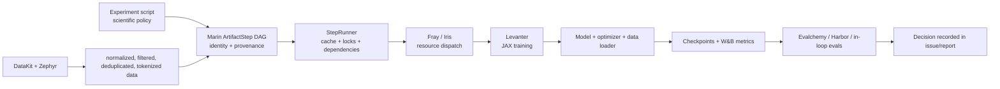

# Learning large-model development through Marin

> Scope note (2026-08-23): this plan emphasizes local reproduction. If your goal is to study how Marin's team makes model-development decisions, start with [How Marin develops large models](./MARIN_MODEL_DEVELOPMENT_TRAITS.md). The local exercises here are optional follow-up work.

Research snapshot: 2026-08-23, Marin commit `e7c34f396f8f2780fc76bb60bcb7263900540534`.

This is a hands-on apprenticeship plan, not a reading list. The goal is to learn the full model-development loop at a scale you can afford:

1. turn raw text into reproducible training data;
2. define a model, optimizer, data mixture, and compute budget;
3. train and resume it;
4. evaluate it without fooling yourself;
5. run controlled ablations and scaling experiments;
6. diagnose failures in data, numerics, kernels, and infrastructure;
7. communicate a decision through an experiment issue and a concise report.

You cannot reproduce Marin's multi-rack hero run on a desktop. You can reproduce its scientific method and most of its software path with nano-to-150M models, then use the public large-scale runs to study what changes when hardware and model scale become first-class constraints.

## The mental model



The most important separation is:

- `experiments/` states the scientific choices.
- `lib/marin/` turns them into reproducible artifacts and jobs.
- `lib/levanter/` implements the model and optimization loop.
- `lib/haliax/` gives JAX named tensors and sharding.
- `lib/zephyr/` processes datasets.
- `lib/fray/` abstracts local versus remote execution.
- `lib/iris/` schedules distributed jobs and recovers failures.

## Your machine and recommended setup

This machine has an RTX 4070 Ti SUPER with 16 GB VRAM, about 32 GB system RAM, NVIDIA driver 591.86, and Python 3.12. It does not currently have `uv` or a WSL Linux distribution. That is enough for the CPU tutorial, nano-model GPU training, and carefully sized 150M experiments.

Use WSL2 with Ubuntu 24.04. Marin's current GPU instructions assume Ubuntu, NVIDIA driver 580+, and the CUDA 13 JAX runtime. Do not develop from the OneDrive checkout through `/mnt/c`; build and training I/O are much faster and less fragile inside WSL's Linux filesystem.

Run this once from an Administrator PowerShell prompt:

```powershell
wsl --install -d Ubuntu-24.04
```

After the requested reboot, run inside Ubuntu:

```bash
sudo apt update
sudo apt install -y build-essential curl git
curl -LsSf https://astral.sh/uv/install.sh | sh
source "$HOME/.local/bin/env"

mkdir -p ~/src
cd ~/src
git clone https://github.com/marin-community/marin.git
cd marin

uv sync --all-packages --extra=gpu
nvidia-smi

export MARIN_PREFIX="$PWD/local_store"
wandb offline
```

Keep this Windows checkout as your annotated research copy. Use the WSL checkout to build and train.

## The code-reading spine

Read in this order. Do not begin by reading the hero MoE implementation.

| Order | File | Question to answer |
|---:|---|---|
| 1 | [`experiments/tutorials/train_tiny_model.py`](https://github.com/marin-community/marin/blob/e7c34f396f8f2780fc76bb60bcb7263900540534/experiments/tutorials/train_tiny_model.py) | Where are model, data, optimizer, token budget, and hardware chosen? |
| 2 | [`lib/marin/src/marin/experiment/data.py`](https://github.com/marin-community/marin/blob/e7c34f396f8f2780fc76bb60bcb7263900540534/lib/marin/src/marin/experiment/data.py) | How does raw or pretokenized data become a typed lazy handle? |
| 3 | [`lib/marin/src/marin/experiment/train.py`](https://github.com/marin-community/marin/blob/e7c34f396f8f2780fc76bb60bcb7263900540534/lib/marin/src/marin/experiment/train.py) | Which choices define an experiment, and which are runtime plumbing? |
| 4 | [`lib/marin/src/marin/execution/lazy.py`](https://github.com/marin-community/marin/blob/e7c34f396f8f2780fc76bb60bcb7263900540534/lib/marin/src/marin/execution/lazy.py) | How do `name`, `version`, dependencies, fingerprints, and lowering work? |
| 5 | [`lib/marin/src/marin/execution/step_runner.py`](https://github.com/marin-community/marin/blob/e7c34f396f8f2780fc76bb60bcb7263900540534/lib/marin/src/marin/execution/step_runner.py) | How are caching, locks, failure retry, and remote steps handled? |
| 6 | [`lib/marin/src/marin/training/training.py`](https://github.com/marin-community/marin/blob/e7c34f396f8f2780fc76bb60bcb7263900540534/lib/marin/src/marin/training/training.py) | How is the Levanter config prepared and dispatched? |
| 7 | [`lib/levanter/src/levanter/main/train_lm.py`](https://github.com/marin-community/marin/blob/e7c34f396f8f2780fc76bb60bcb7263900540534/lib/levanter/src/levanter/main/train_lm.py) | How are tokenizer, model, dataset, checkpoint, hooks, and training joined? |
| 8 | [`lib/levanter/src/levanter/trainer.py`](https://github.com/marin-community/marin/blob/e7c34f396f8f2780fc76bb60bcb7263900540534/lib/levanter/src/levanter/trainer.py) | What exactly happens in `train`, `train_step`, gradient computation, and checkpoint hooks? |
| 9 | [`lib/levanter/src/levanter/models/llama.py`](https://github.com/marin-community/marin/blob/e7c34f396f8f2780fc76bb60bcb7263900540534/lib/levanter/src/levanter/models/llama.py) | Trace embeddings -> attention/MLP blocks -> LM head -> next-token loss. |
| 10 | [`experiments/datakit/README.md`](https://github.com/marin-community/marin/blob/e7c34f396f8f2780fc76bb60bcb7263900540534/experiments/datakit/README.md) | How does production data reach training-ready stores? |

Useful landmarks inside the larger files:

- `train_lm(...)`: `lib/marin/src/marin/experiment/train.py:101`
- Levanter entry point: `lib/levanter/src/levanter/main/train_lm.py:150`
- generic training loop: `lib/levanter/src/levanter/trainer.py:592`
- compiled optimization step: `lib/levanter/src/levanter/trainer.py:732`
- Llama decoder layer: `lib/levanter/src/levanter/models/llama.py:297`
- Llama language-model head: `lib/levanter/src/levanter/models/llama.py:514`

For every file, write three sentences: what it owns, what it deliberately does not own, and the object it passes to the next layer.

## How the GitHub issues fit together

Treat an issue as a lab notebook and coordination record, not a ticket. The useful chain is:

```text
weekly standup -> launch/epic issue -> experiment issue -> PR/branch
               -> W&B or public artifact -> conclusion -> next decision
```

Use these threads as the core case studies:

| Theme | Issue | What to learn |
|---|---|---|
| Weekly orientation | [#8394: Aug 17 standup](https://github.com/marin-community/marin/issues/8394) | How individual work streams roll up into one model launch. Follow its link backward to #8019 and #7669. |
| Integration discipline | [#8233: next hero run burndown](https://github.com/marin-community/marin/issues/8233) | A large run launches only after architecture, numerics, runtime, reliability, and data gates have an explicit decision. |
| Scaling laws | [#1337: Delphi scaling suite](https://github.com/marin-community/marin/issues/1337) | How small models and repeated seeds become a prediction instrument for large models. |
| Compute-optimal search | [#8003: hero iso-FLOP sweep](https://github.com/marin-community/marin/issues/8003) | Hold FLOPs fixed, vary width/tokens, fit U-curves, and keep high-budget conclusions provisional until missing cells close. |
| Controlled ablations | [#8227: feature ablations](https://github.com/marin-community/marin/issues/8227) | Remove one feature at a time at matched compute. |
| Systems performance | [#7201: GB200 TPS tracker](https://github.com/marin-community/marin/issues/7201) | Quality is constrained by tokens/second, memory, routing drops, and Model FLOPs Utilization (MFU), not parameter count alone. |
| Data | [#6037: DataKit hero run](https://github.com/marin-community/marin/issues/6037) | Dataset inclusion, deduplication, mixture selection, evaluation, and versioned production artifacts are launch gates. |
| Evaluation validity | [#7930: Terminus-2 parity](https://github.com/marin-community/marin/issues/7930) | Separate model quality from infrastructure failures, parser/config drift, timeout effects, and serving performance. |
| SFT | [#8225: three-stage Snowball SFT](https://github.com/marin-community/marin/issues/8225) | A successful pipeline can still improve some competencies and regress others; keep intermediate checkpoints and evaluate every stage. |
| RL and capability | [#6279: Delphi RL scaling laws](https://github.com/marin-community/marin/issues/6279) | Midtraining can create latent capability, SFT can elicit it, and RL can add lift while context limits distort results. |

Do not read every comment chronologically. For each thread, capture:

1. hypothesis and primary metric;
2. fixed controls and changed variable;
3. run budget and hardware;
4. code/PR that defines the run;
5. artifact or W&B evidence;
6. failure modes and confounders;
7. decision and what it unlocked.

## Eleven-week apprenticeship

Assume 8-10 focused hours each week. If you have more time, add repetitions rather than skipping ahead.

### Week 0 — Environment and one complete run

Read:

- [`docs/tutorials/installation.md`](https://github.com/marin-community/marin/blob/e7c34f396f8f2780fc76bb60bcb7263900540534/docs/tutorials/installation.md)
- [`docs/tutorials/first-experiment.md`](https://github.com/marin-community/marin/blob/e7c34f396f8f2780fc76bb60bcb7263900540534/docs/tutorials/first-experiment.md)
- [`docs/explanations/lazy-artifacts.md`](https://github.com/marin-community/marin/blob/e7c34f396f8f2780fc76bb60bcb7263900540534/docs/explanations/lazy-artifacts.md)

Run first on CPU:

```bash
uv run python -m experiments.tutorials.train_tiny_model \
  --device cpu --dataset tinystories --version dev --run
```

Then run on your GPU:

```bash
uv run python -m experiments.tutorials.train_tiny_model \
  --device h100x1 --dataset tinystories --version dev --run
```

In a plain local shell Fray falls back to its in-process local backend, which does not enforce the `h100x1` SKU label; JAX will see your one local NVIDIA GPU. Do not use the `h100x8` choice on this machine.

Deliverable: a one-page run map showing the tokenized artifact, checkpoint artifact, final loss, wall time, device, and what happens on a rerun.

Exit check: you can explain why constructing an `ArtifactStep` does no work, why `--run` matters, and why a calendar version differs from `dev`.

### Week 1 — Trace one batch from text to loss

Read the first nine files in the code-reading spine. Focus only on the called path.

Exercise:

- Start at `dataset("tinystories")`.
- Trace the data handle through `train_lm`, `TrainLmConfig`, `train_dataset`, `DataLoader`, `LmExample`, `compute_next_token_loss`, gradient calculation, optimizer update, and checkpoint hook.
- Record the shape and named axes at embeddings, attention, MLP output, and logits.

Deliverable: a call graph with file and function names. It should fit on one screen.

Exit check: you can point to the exact function that computes gradients and the exact model method that creates logits.

### Week 2 — Learn the transformer by changing it

Make a personal experiment file based on `train_tiny_model.py`; do not edit the shared tutorial in place.

Run four tiny variants with the same data, tokenizer, batch size, sequence length, steps, and seed:

| Arm | Change |
|---|---|
| A | baseline `llama_nano` |
| B | double `hidden_dim`; adjust head count so head dimension remains sensible |
| C | double `num_layers` |
| D | use grouped-query attention by reducing `num_kv_heads` |

Measure parameter count, final training loss, tokens/second, peak VRAM, and wall time. This is not meant to identify a good architecture; it teaches which code and metrics move when architecture moves.

Deliverable: a table plus a 200-word conclusion that distinguishes observed facts from explanations.

Exit check: you can explain attention heads versus KV heads, residual blocks, RMSNorm, SwiGLU-style MLPs, and why more parameters are not a fair comparison without a compute budget.

### Week 3 — Optimization and controlled ablations

Read:

- [`docs/tutorials/add-optimizer.md`](https://github.com/marin-community/marin/blob/e7c34f396f8f2780fc76bb60bcb7263900540534/docs/tutorials/add-optimizer.md)
- [#8227](https://github.com/marin-community/marin/issues/8227)
- the optimizer and schedule fields in [`lib/levanter/src/levanter/optim/config.py`](https://github.com/marin-community/marin/blob/e7c34f396f8f2780fc76bb60bcb7263900540534/lib/levanter/src/levanter/optim/config.py)

Run a small learning-rate sweep, for example `1e-4`, `3e-4`, `6e-4`, `1e-3`, with everything else fixed. Use at least two seeds for the best two settings if time permits. Plot loss versus both steps and tokens.

Then do one true ablation: toggle exactly one architectural or regularization feature while holding the run budget fixed.

Deliverable: a miniature experiment issue containing hypothesis, preregistered primary metric, controls, run matrix, result, and decision.

Exit check: you reject a result when more than one meaningful variable changed or the comparison used unequal token budgets without justification.

### Week 4 — Data is part of the model

Read:

- [`docs/explanations/lm-pipeline.md`](https://github.com/marin-community/marin/blob/e7c34f396f8f2780fc76bb60bcb7263900540534/docs/explanations/lm-pipeline.md)
- [`docs/design/2355_datakit.md`](https://github.com/marin-community/marin/blob/e7c34f396f8f2780fc76bb60bcb7263900540534/docs/design/2355_datakit.md)
- [`experiments/datakit/README.md`](https://github.com/marin-community/marin/blob/e7c34f396f8f2780fc76bb60bcb7263900540534/experiments/datakit/README.md)
- the Bison/Mantis data sections of [`docs/reports/marin-32b-retro.md`](https://github.com/marin-community/marin/blob/e7c34f396f8f2780fc76bb60bcb7263900540534/docs/reports/marin-32b-retro.md)

Build a tiny two-source mixture from TinyStories and WikiText. Compare 100/0, 50/50, and 0/100 under the same token budget. Create a held-out loss for each domain. Inspect actual decoded samples before training.

Add three data checks:

- exact-duplicate rate on your sample;
- train/eval overlap by normalized text hash;
- token-length and source-share distributions after tokenization.

Deliverable: a dataset card and a matrix of cross-domain validation losses.

Exit check: you can explain why per-domain validation, deterministic IDs, decontamination, shuffle quality, and mixture weights can matter more than a small architecture tweak.

### Week 5 — Evaluation without self-deception

Read:

- [`docs/explanations/evaluation.md`](https://github.com/marin-community/marin/blob/e7c34f396f8f2780fc76bb60bcb7263900540534/docs/explanations/evaluation.md)
- [`docs/tutorials/run-lm-evals.md`](https://github.com/marin-community/marin/blob/e7c34f396f8f2780fc76bb60bcb7263900540534/docs/tutorials/run-lm-evals.md)
- [#7930](https://github.com/marin-community/marin/issues/7930)

For your tiny model, use loss/perplexity first; task accuracy will be mostly noise. Create an evaluation manifest containing model identity, checkpoint, tokenizer, task/data revision, prompt format, context length, generation settings, sample count, and infrastructure-success count.

Re-run the same checkpoint with one intentional prompt-format change. The point is to see that evaluation configuration is part of the experiment.

Deliverable: an evaluation report that separates model failures, evaluator/config failures, and infrastructure failures.

Exit check: you will not compare two scores until tokenizer, prompt, context, sampling, task revision, and completion coverage are accounted for.

### Week 6 — Scaling laws and iso-FLOP thinking

Read:

- [#1337](https://github.com/marin-community/marin/issues/1337)
- [#8003](https://github.com/marin-community/marin/issues/8003)
- [`docs/recipes/add_scaling_heuristic.md`](https://github.com/marin-community/marin/blob/e7c34f396f8f2780fc76bb60bcb7263900540534/docs/recipes/add_scaling_heuristic.md)

Choose three model widths and three token budgets. You do not need all nine cells initially. At each fixed approximate FLOP budget, trade parameters against training tokens. Use the repository's config methods for parameter and FLOP estimates instead of inventing a proxy when possible.

Fit a simple curve only after plotting raw points. Hold out the largest affordable cell and predict it from smaller cells. Report prediction error, not only fit quality.

Deliverable: iso-FLOP curves, your predicted optimum, the held-out result, and a note on uncertainty.

Exit check: you understand why the key scaling-law product is a decision at a larger budget, not a beautiful in-sample line.

### Week 7 — Reliability, loss spikes, and recovery

Read in order:

- [`docs/reports/marin-8b-retro.md`](https://github.com/marin-community/marin/blob/e7c34f396f8f2780fc76bb60bcb7263900540534/docs/reports/marin-8b-retro.md)
- [`docs/reports/marin-32b-retro.md`](https://github.com/marin-community/marin/blob/e7c34f396f8f2780fc76bb60bcb7263900540534/docs/reports/marin-32b-retro.md)
- [`docs/ops/training-loss-spike-alert.md`](https://github.com/marin-community/marin/blob/e7c34f396f8f2780fc76bb60bcb7263900540534/docs/ops/training-loss-spike-alert.md)

The two retrospectives are especially valuable:

- Marin 8B shows an adaptive, mid-flight "Tootsie" process, microannealing, reheating/cooldown, and mistakes such as rotary settings and omitted z-loss.
- Marin 32B shows that clipping and optimizer restarts could soften but not solve instability; QK-Norm removed spikes after a short recovery. It also shows contamination and poor shuffling creating misleading results.

Exercise: interrupt a tiny run, resume it from checkpoint, and verify step/loss continuity. Create a deliberately unstable high-LR arm and collect loss, gradient norm, update norm, throughput, and checkpoint evidence. Do not try to make it crash hardware.

Deliverable: an incident note with timeline, evidence, competing hypotheses, smallest reproduction, mitigation, and whether root cause is proven.

Exit check: you distinguish a model/numerics loss spike from a data-distribution phase shift and from an infrastructure stall.

### Week 8 — Mixture-of-experts and systems performance

Read:

- [`experiments/grug/moe_hero_ep/README.md`](https://github.com/marin-community/marin/blob/e7c34f396f8f2780fc76bb60bcb7263900540534/experiments/grug/moe_hero_ep/README.md)
- [`experiments/grug/moe_hero_ep/heuristic.py`](https://github.com/marin-community/marin/blob/e7c34f396f8f2780fc76bb60bcb7263900540534/experiments/grug/moe_hero_ep/heuristic.py)
- [#7201](https://github.com/marin-community/marin/issues/7201)
- [#8233](https://github.com/marin-community/marin/issues/8233)

Trace the current hero configuration: 384 routed experts, top-8 routing, shared experts, expert parallelism, capacity factors, routing drops, MuonH, BF16, and the measured MFU/TPS gates. Do not attempt the hero launcher locally.

Paper exercise: for two candidate MoE shapes, compare total parameters, active parameters per token, expert weight traffic, expected routing capacity, and projected training duration from measured TPS. Write down which result would change your launch choice.

Optional code exercise: run an existing very small Grug test or model-construction test, not a multi-GPU experiment.

Deliverable: a one-page explanation of why the model with more total experts can be slower at equal active parameters.

Exit check: you can explain FSDP versus expert parallelism, all-to-all communication, routing drops, MFU, TPS, and why quality and throughput must be optimized together.

### Week 9 — Midtraining, SFT, and RL

Read:

- [#8225](https://github.com/marin-community/marin/issues/8225)
- [#6279](https://github.com/marin-community/marin/issues/6279)
- [`experiments/sft/launcher.py`](https://github.com/marin-community/marin/blob/e7c34f396f8f2780fc76bb60bcb7263900540534/experiments/sft/launcher.py)
- [`experiments/post_training/iceball_micro.py`](https://github.com/marin-community/marin/blob/e7c34f396f8f2780fc76bb60bcb7263900540534/experiments/post_training/iceball_micro.py)

Conceptual experiment: take one base checkpoint, continue training briefly on a narrow math-like or instruction-like corpus, and compare:

1. base;
2. continued/midtrained;
3. SFT from base;
4. SFT from midtrained.

At desktop scale, treat this as a pipeline and measurement exercise, not a claim about reasoning. Keep every intermediate checkpoint.

Deliverable: a capability-flow diagram explaining the hypothesis "midtraining supplies capability; SFT elicits it; RL may improve policy," plus results and caveats from your small proxy.

Exit check: you no longer treat pretraining, midtraining, SFT, and RL as interchangeable fine-tuning stages.

### Week 10 — Reconstruct a live Marin decision

Start at the latest standup and choose one architecture, data, evaluation, or post-training thread. Follow it through its parent issue, PR, code, artifacts, and conclusion.

Before reading the final result, write your prediction. Then compare your decision with the team's decision and identify which evidence changed it.

Deliverable: a two-page decision memo with links and a dependency tree.

Exit check: another reader can reproduce your reasoning without attending the meeting.

### Week 11 — Capstone and contribution

Capstone: train the best small recipe you discovered, from data manifest through evaluation, and publish locally:

- experiment script;
- immutable run configuration;
- data card and contamination checks;
- checkpoint and resume proof;
- W&B/offline metrics export;
- evaluation manifest and results;
- ablation table;
- model card;
- honest limitations and cost record.

Contribution path: choose a documentation problem, a missing test for behavior you exercised, or a small `good first issue`. Reproduce it before editing, follow `CONTRIBUTING.md`, and keep the PR narrowly tied to observed evidence.

Exit check: you can defend the run as a scientific artifact, not just show generated text.

## Weekly standup apprenticeship

Use these commands from the checkout:

```bash
gh issue list --repo marin-community/marin \
  --state all --label stand-up --limit 20

gh issue view 8394 --repo marin-community/marin \
  --json title,body,comments,url

gh issue list --repo marin-community/marin \
  --state open --label experiment --limit 50
```

Every week:

1. Read the latest standup and select one linked issue.
2. Write what you think will happen next and the metric that should decide it.
3. Locate the exact experiment config or branch.
4. Return after the next update and score your prediction.
5. Add one reusable lesson to your own playbook.

This turns passive issue reading into repeated practice in research judgment.

## Experiment record template

Use this for every run:

```markdown
# <short experiment title>

## Question
One falsifiable question.

## Hypothesis
Expected direction and why.

## Primary metric
One metric and the comparison/threshold chosen before launch.

## Fixed controls
Data revision, tokenizer, seed policy, sequence length, token/FLOP budget,
evaluation config, hardware, and software commit.

## Arms
The exact variable changed in each arm.

## Run identities
Artifact name/version, checkpoint, W&B/offline run path, start/end time.

## Results
Raw table first; plots second.

## Failures and confounders
Missing cells, retries, non-finite steps, infrastructure coverage, prompt drift,
data overlap, or unequal budgets.

## Decision
What the evidence supports, what it does not support, and the next experiment.
```

## Guardrails

- Print or inspect a plan before any cloud or shared-cluster run.
- Set a hard spending/time cap before renting accelerators.
- Scale the software path first, then model size; do not make your first distributed run a 1B model.
- Never infer model quality from training loss alone.
- Never change multiple scientific variables in an ablation unless the compound recipe is the explicit object of study.
- Keep dataset, tokenizer, checkpoint, code commit, and eval configuration immutable in the record.
- Treat timeouts, parser changes, prompt changes, truncation, and missing trials as experimental variables.
- Preserve failed runs. Marin's most useful lessons often come from the failure trail.

## Recommended first three sessions

1. Install WSL2/Ubuntu and `uv`; get the CPU TinyStories run to complete and rerun from cache.
2. Run the same nano recipe on the 4070 Ti SUPER; compare wall time, throughput, and artifact identity.
3. Trace the call path through `train_lm`, Levanter `main`, `Trainer.train_step`, and `LlamaLMHeadModel`, then write your first one-screen call graph.

Do those before reading the current hero MoE model. The hero code becomes much more legible after you can already see the same lifecycle in a two-layer Llama.
