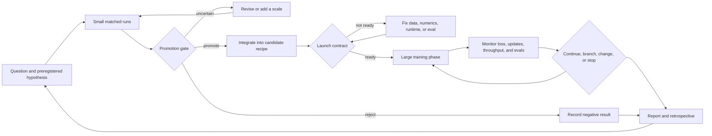

# How Marin develops large models

> For a broader interview curriculum that combines these cases with LLM theory, systems, post-training, inference, RAG, and agents, see [LLM interview tutorial](./LLM_INTERVIEW_TUTORIAL_2026.md).

Research snapshot: 2026-08-23, Marin commit `e7c34f396f8f2780fc76bb60bcb7263900540534`.

Effort: medium. I traced current standups into experiment issues, retrospectives, reports, and the code that records experiment choices. I stopped when additional issue families repeated the same operating patterns without changing the ranked conclusions. Marin's Echo prior-work search was unavailable in this checkout because its runtime dependencies are not installed; the source ledger therefore uses durable public artifacts only.

## TL;DR

Marin's defining trait is **adaptive empiricism**. The team does not treat model development as executing a known recipe. It treats it as a campaign of linked decisions:

1. state a hypothesis and the decision it could change;
2. test it cheaply at one or more controlled scales;
3. judge both learning quality and wall-clock cost;
4. promote, reject, or revise it;
5. integrate survivors behind data, numerics, systems, and evaluation gates;
6. continue monitoring and sometimes modify the large run;
7. publish failures and retrospective lessons.

The human traits behind that loop are empirical, scale-aware, systems-aware, skeptical of metrics, willing to discard failed ideas, and unusually candid about mistakes. The main tension is that their pragmatism sometimes weakens clean causal attribution: an expensive run may change data, hardware, schedule, and architecture together. Their later process adds stricter gates and small-scale comparisons to control that risk.

You do not need to run the code to learn this. The best apprenticeship is to reconstruct their decision-making from issue chains and make your own prediction before reading each result.

## The operating loop



Three loops are nested here:

- **Scientific loop:** hypothesis, comparison, decision.
- **Run loop:** monitor and adapt a long, expensive training trajectory.
- **Program loop:** improve the process itself after failures.

## The traits that matter

| Rank | Trait | What it looks like in practice | Best case to study |
|---:|---|---|---|
| 1 | Adaptive, not recipe-bound | A large run is a living campaign with branches, cooldowns, restarts, and new data | [Tootsie #600](https://github.com/marin-community/marin/issues/600) and the [8B retrospective](https://github.com/marin-community/marin/blob/main/docs/reports/marin-8b-retro.md) |
| 2 | Decisions are bought with cheap evidence | Matched ablations and scale ladders screen ideas before large commitments | [Agent MoE digest](https://github.com/marin-community/marin/blob/main/docs/reports/agent-moe-experiments.md) and [ISO-FLOP #8003](https://github.com/marin-community/marin/issues/8003) |
| 3 | Time-to-quality is the objective | Loss improvement is discounted when an idea reduces throughput or scaling efficiency | [MoE versus dense #1183](https://github.com/marin-community/marin/issues/1183) and [throughput tracker #7201](https://github.com/marin-community/marin/issues/7201) |
| 4 | Data is part of the model | Mixture, order, filtering, contamination, and prompt format are treated as causal variables | [32B retrospective](https://github.com/marin-community/marin/blob/main/docs/reports/marin-32b-retro.md) and [DataKit hero run #6037](https://github.com/marin-community/marin/issues/6037) |
| 5 | Evaluation is an adversarial subsystem | Infrastructure failures and prompt sensitivity must be separated from capability changes | [Evaluation parity #7930](https://github.com/marin-community/marin/issues/7930) |
| 6 | Models and systems are co-designed | Architecture, numerics, kernels, topology, and checkpoint recovery jointly determine viability | [Launch readiness #8233](https://github.com/marin-community/marin/issues/8233) |
| 7 | Negative results are useful output | Failed routers, optimizers, regularizers, and run mistakes remain visible and influence defaults | [Agent MoE digest](https://github.com/marin-community/marin/blob/main/docs/reports/agent-moe-experiments.md), [z-loss #935](https://github.com/marin-community/marin/issues/935) |
| 8 | Coordination is part of the science | Weekly standups connect many narrow workstreams to one candidate training recipe | [August 17 standup #8394](https://github.com/marin-community/marin/issues/8394) |

### 1. They develop a campaign, not a frozen recipe

The 8B Tootsie run is the clearest example. Its phases were not fully planned in advance. The team changed the WSD-S schedule, moved hardware, increased batch size and learning rate, corrected RoPE, replaced data, ran cooldowns, and branched into later phases as evidence and resources changed. Some changes worked; others exposed corrupted data or wrong weights.

This is not a claim that changing many variables is good experimental design. It is evidence of how frontier development actually differs from a clean paper experiment. Compute has already been spent, data arrives at different times, hardware availability changes, and a model checkpoint has option value. Marin often preserves that option through warm starts and branches instead of discarding the whole trajectory.

What to learn:

- Distinguish a **controlled experiment** from an **operational intervention** on a valuable run.
- Ask what evidence justified changing the run now rather than waiting.
- Track which later ablations recover causal confidence after several variables changed together.

### 2. They use small runs as decision instruments

The Agent MoE program uses toy-scale trainings as promotion screens. Each run is designed to answer whether an idea deserves promotion. As of August 20, its digest covered 80 experiments: 16 worked, 9 were promising, 13 were mixed, 32 did not work, 6 were not evaluated, and 4 were in progress. The low survival rate is a feature of the process.

The scale ladder matters because a win at one width may reverse at another. The ISO-FLOP study fits compute-optimal behavior across several widths and budgets. It also shows pragmatism: some unfinished cells were stopped after the target architecture changed, because completing an obsolete grid would no longer change a live decision.

What to learn:

- Begin with the decision, not the experiment: “What will we do differently if this wins?”
- Use matched baselines and more than one scale before trusting a small advantage.
- Make the promotion threshold explicit before looking at results.
- Stop when the remaining evidence cannot affect the current recipe.

### 3. They optimize wall-clock progress, not an isolated metric

Marin regularly translates loss gains into equivalent model-FLOPs and then adjusts for measured throughput. An architectural idea can improve validation loss and still lose if kernels make it 30% slower. Conversely, MoE can have lower hardware utilization than a dense model yet win on time-to-quality.

This changes how to read their architecture work. “Better model” means a system that reaches a target quality sooner under real hardware constraints, not the configuration with the cleanest theoretical FLOP count or highest MFU.

What to learn:

- Keep quality, theoretical compute, measured tokens per second, memory, and failure rate separate.
- Calculate the break-even point: how much quality gain pays for the throughput cost?
- Treat MFU as a diagnostic, not the goal.

### 4. They treat data as a first-class model component

The 32B Bison-to-Mantis story shows why. A cached dataset included GSM8K test items in a different prompt format. This contamination did not produce a simple inflated score; it made the model unusually fragile under the standard prompt. A weak shuffle also created a training-loss phase shift even when validation looked steadier. The response was not “data cleanup” at the edge of the project. It changed the training artifact, shuffle algorithm, evaluation interpretation, and next phase.

Other mixture studies show the same discipline. High-quality-only microannealing could improve in-domain validation loss while hurting downstream task performance; adding instruction data in moderation changed that outcome. More filtered web data could beat a much smaller “high-quality” source despite repeated epochs on the latter.

What to learn:

- For every model result, inspect data identity, mixture weights, order, epoching, caching, and contamination.
- Do not equate lower held-out language-model loss with broader capability.
- Version a mixture as carefully as an architecture.

### 5. They distrust evaluation plumbing

Evaluation parity work separates three questions that are often collapsed:

1. Did the model generate a useful answer?
2. Did the serving system finish the generation?
3. Did the parser and scorer recognize it?

In #7930, timeouts, output budgets, parser formats, and decode bottlenecks could masquerade as model-quality regressions. The team imposed an infrastructure-clean threshold before treating a comparison as a scientific result. The retrospectives add another warning: tiny preprocessing details, such as trailing spaces or prompt formats, can move reported evaluations.

What to learn:

- Audit failures before averaging scores.
- Inspect raw generations for any surprising metric change.
- Require a clean-run rate before comparing models.
- Report competency-specific regressions instead of hiding them in an aggregate.

### 6. They co-design model, numerics, and distributed systems

At large scale, a modeling choice is incomplete until it has a stable numerical implementation and acceptable topology behavior. The current launch contract spans architecture, loss behavior, throughput, rack scaling, checkpoint save and restore, data identity, alerts, and a named owner. This is why standups interleave MoE routing, Pallas kernels, all-to-all communication, checkpointing, telemetry, mixtures, and evaluations.

The 32B run demonstrates the diagnostic side. Clipping and step skipping softened loss spikes but did not remove the cause. Optimizer changes briefly stabilized training and then failed. QK-Norm caused a short penalty but ultimately removed the spikes. The reusable lesson is to instrument enough internal behavior to distinguish a symptom treatment from a structural fix.

What to learn:

- A hero-run candidate needs quality evidence, throughput evidence, and recovery evidence.
- A numerical workaround that suppresses spikes is not necessarily a root-cause fix.
- Every new architecture feature creates a kernel and distributed-scaling question.

### 7. They preserve failure as organizational memory

Marin's public record contains failures that a polished paper would often omit: corrupted data, wrong cooldown weights, missing math data, unstable restarts, neutral regularizers, failed router variants, and scale-dependent reversals. The Agent MoE digest labels “did not work” and “mixed” separately. The retrospectives explain how the team was fooled alongside the final recipe.

This matters because defaults are compressed negative knowledge. Keeping logit z-loss, QK-Norm, a particular shuffle, or a 4k sequence length makes more sense when you can inspect what broke without it.

What to learn:

- Read negative issues before copying a final configuration.
- Record the smallest failing boundary and the evidence that ruled out an idea.
- Distinguish “false,” “not worth its wall-clock cost,” and “not yet tested cleanly.”

### 8. They make coordination legible

The standup issue is an index, not the whole scientific record. It links individual work to experiment trackers, reports, runs, and blockers. The experiment issue states a hypothesis and receives results. The PR connects that claim to executable changes. W&B and artifacts hold measurements. Retrospectives synthesize what survived.

The useful reading path is therefore:

```text
standup → program/epic → experiment issue → linked PR/code → run metrics → report/decision
```

Do not read only the latest comment or issue body. Older issues can be terse, automated summaries can be incomplete, and the strongest interpretation may appear later in a retrospective.

## Where the method is strongest—and where it is vulnerable

| Tension | Strength | Vulnerability | How Marin compensates |
|---|---|---|---|
| Adaptation vs. causal clarity | Salvages learning and checkpoint value during long runs | Several simultaneous changes make attribution weak | Side ablations, branches, later retrospectives |
| Fast screens vs. scale validity | Rejects many ideas cheaply | A small-scale win may reverse | Multiple widths, scaling fits, larger promotion gates |
| Openness vs. source quality | Exposes real mistakes and work in progress | Issue state and automated summaries are not final scientific verdicts | Curated reports, machine-readable snapshots, linked runs |
| Metric discipline vs. Goodhart risk | Uses explicit gates and compute-equivalent speedups | A gate can still miss a competency or serving constraint | Several eval families, raw-output inspection, wall-clock accounting |
| Reproducibility vs. changing frontier targets | Versioned artifacts make runs traceable | Architecture and hardware can change before a grid completes | Stop obsolete work and restate the live decision |

The most important historical change is process maturation. The early 8B campaign was openly reactive. Current MoE development has stricter promotion gates, baseline tables, launch contracts, and synthesized experiment digests. Study both eras: the contrast shows which controls were learned from experience.

## A six-week apprenticeship with no local training

Spend about four hours per week. Your output is a decision notebook, not code.

### Week 1 — Reconstruct an adaptive run

Read:

- [Tootsie #600](https://github.com/marin-community/marin/issues/600), including comments in chronological order
- [Marin 8B retrospective](https://github.com/marin-community/marin/blob/main/docs/reports/marin-8b-retro.md)

Produce:

- a timeline of checkpoints and interventions;
- the evidence available at each decision time;
- a label for each change: planned experiment, emergency fix, opportunistic improvement, or retrospective correction;
- three places where causal attribution became weak.

### Week 2 — Diagnose a failing large run

Read:

- [Marin 32B retrospective](https://github.com/marin-community/marin/blob/main/docs/reports/marin-32b-retro.md)
- linked issues for instability, contamination, and shuffle failures

Before reading each outcome, write your next action. Then compare it with the team's choice.

Produce a fault tree with four branches: data, optimization, model architecture, and infrastructure. Note which observations distinguish them.

### Week 3 — Learn promotion gates

Read:

- [learning-rate schedule #764](https://github.com/marin-community/marin/issues/764)
- [MoE versus dense #1183](https://github.com/marin-community/marin/issues/1183)
- [feature ablations #8227](https://github.com/marin-community/marin/issues/8227)
- [Agent MoE digest](https://github.com/marin-community/marin/blob/main/docs/reports/agent-moe-experiments.md)

Pick eight experiments: two worked, two failed, two mixed, and two promising. For each, recover the hypothesis, control, scales, metrics, threshold, result, and decision. Explain why “better loss” and “promote” are not synonyms.

### Week 4 — Study scaling as forecasting

Read:

- [Delphi issue #1337](https://github.com/marin-community/marin/issues/1337)
- [ISO-FLOP study #8003](https://github.com/marin-community/marin/issues/8003)
- [Delphi report](https://openathena.ai/blog/delphi/)

Produce a forecast audit:

- Which runs fit the law and which were held out?
- Which predictions were interpolation and which were extrapolation?
- What would falsify the forecast?
- When did architecture changes make further cells less valuable?

### Week 5 — Treat data and evaluation as scientific instruments

Read:

- data sections of the 8B and 32B retrospectives;
- [DataKit hero run #6037](https://github.com/marin-community/marin/issues/6037);
- [evaluation parity #7930](https://github.com/marin-community/marin/issues/7930);
- [SFT pipeline #8225](https://github.com/marin-community/marin/issues/8225).

Produce two checklists: a data-integrity gate and an evaluation-integrity gate. Include a rule for mixed results: #8225 reports 30 improving and 21 regressing sequential comparisons, so your summary must retain task-level tradeoffs.

### Week 6 — Sit on a fictional launch review

Read:

- [August 17 standup #8394](https://github.com/marin-community/marin/issues/8394);
- [hero-run readiness #8233](https://github.com/marin-community/marin/issues/8233);
- [throughput tracker #7201](https://github.com/marin-community/marin/issues/7201);
- current linked architecture, data, evaluation, and reliability issues.

Write a one-page **launch / do not launch** memo using only evidence that existed at the standup date. Name:

- the candidate recipe;
- its strongest evidence;
- unresolved blockers;
- expected training duration and principal failure modes;
- stop conditions;
- the first three dashboards you would watch.

Afterward, follow later standups and revise the memo. This is the closest no-compute exercise to participating in the development program.

## The decision-notebook template

Use this for every case:

```markdown
# Decision: <short name>

Date and information cutoff:
Decision owner:
Question:
Why it matters now:

## Prior belief
- Expected outcome:
- Confidence:
- Mechanism:

## Test
- Baseline and treatment:
- What is held constant:
- Scale(s):
- Quality metrics:
- Throughput/reliability metrics:
- Preregistered promotion and stop rules:

## Evidence
- Result:
- Infrastructure-clean?:
- Confounders:
- Scale-transfer risk:

## Decision
- Promote / reject / revise / gather more evidence:
- Why:
- What would change this decision:

## Retrospective
- What actually happened later:
- Which belief was wrong:
- Reusable lesson:
```

The information cutoff is essential. It prevents hindsight from turning a difficult real-time decision into an obvious story.

## Evidence map

| Claim | Direct support | Counterevidence or limitation | Confidence | Study action |
|---|---|---|---|---|
| Marin is adaptive rather than recipe-bound | #600 and 8B retrospective document unplanned phases and mid-run changes | Simultaneous changes weaken attribution | High | Build the Week 1 intervention timeline |
| Small-scale gates drive architecture choices | Agent MoE digest and #8227 compare matched variants across widths | Some promoted ideas still lack large-scale anchors | High | Audit worked, failed, and mixed examples |
| Wall-clock time-to-quality is a core objective | #1183, #7201, and Agent MoE effective-speedup accounting | Throughput measurements can be hardware-specific | High | Recalculate one break-even point |
| Data behavior is inseparable from model behavior | 32B contamination and shuffle failures; #6037 | Some mixture findings are task- and scale-dependent | High | Write data-integrity gates before reading outcomes |
| Evaluation failures can masquerade as model failures | #7930 and retrospective prompt-format failures | A clean harness does not guarantee benchmark validity | High | Separate generation, serving, parsing, and scoring |
| The process has become more formal over time | Contrast early 8B run with current #8233 and Agent MoE gates | Current process is still evolving; not every issue follows it | Medium-high | Compare the two eras explicitly |
| Public issues fully capture the process | Standups and issue chains expose substantial process knowledge | Some issues are terse; W&B, PRs, and reports carry missing context | Low | Triangulate every major claim across artifact types |

## Source ledger

| Source | Role in this brief | Evidentiary value |
|---|---|---|
| [Experiment guidelines](https://github.com/marin-community/marin/blob/main/docs/explanations/guidelines.md) | Stated method: preregistration, small-scale sanity checks, costed dry runs, results returned to issues | Normative; compare against observed practice |
| [Tootsie #600](https://github.com/marin-community/marin/issues/600) | Chronological interventions and mistakes in the 8B campaign | Direct operational record |
| [Marin 8B retrospective](https://github.com/marin-community/marin/blob/main/docs/reports/marin-8b-retro.md) | Later synthesis of adaptive phases, data changes, cooldowns, and errors | Strong synthesis, with hindsight |
| [Marin 32B retrospective](https://github.com/marin-community/marin/blob/main/docs/reports/marin-32b-retro.md) | Instability diagnosis, QK-Norm, data contamination, and shuffle failure | Strong failure analysis |
| [Agent MoE digest](https://github.com/marin-community/marin/blob/main/docs/reports/agent-moe-experiments.md) | 80 controlled screens with worked, mixed, negative, and incomplete outcomes | Curated current snapshot; individual issues remain primary |
| [ISO-FLOP #8003](https://github.com/marin-community/marin/issues/8003) | Scaling-grid design, extrapolation caveats, divergence, and stopping obsolete cells | Direct experiment thread |
| [Hero-run readiness #8233](https://github.com/marin-community/marin/issues/8233) | Current integration contract and launch gates | Direct current process record |
| [Evaluation parity #7930](https://github.com/marin-community/marin/issues/7930) | Separation of infrastructure-clean runs from model results | Direct experiment thread |
| [SFT pipeline #8225](https://github.com/marin-community/marin/issues/8225) | Sequential post-training decisions with both gains and regressions | Direct program synthesis |
| [August 17 standup #8394](https://github.com/marin-community/marin/issues/8394) | Current cross-functional work and blockers | Current index; follow links for evidence |
| [Delphi report](https://openathena.ai/blog/delphi/) | Public explanation of preregistered scaling forecasts | Curated external-facing synthesis |
| [Open development of frontier AI](https://openathena.ai/blog/open-development-of-frontier-ai/) | Marin's stated reason for publishing process knowledge as well as weights | Mission statement; not evidence that every record is complete |

## The standard to aim for

After six weeks, you should be able to look at a proposed architecture or data change and ask:

- What decision is this experiment meant to change?
- What is the cheapest scale that could falsify it?
- What must remain matched?
- Does the gain survive throughput and reliability costs?
- Could data or evaluation plumbing explain the result?
- What evidence is required before a hero-run launch?
- What would make us stop, branch, or reverse course?

That ability—not reproducing a checkpoint—is the transferable craft in Marin's public development record.
