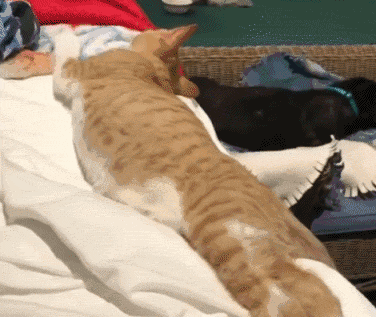

## 04/11/2025
出去打桌游了，回来后研究蛋白粉买哪个，之前那个口味要喝的yue出来了，没刷题，很烦

还以为要被嘲讽了

## 04/21/2025
 
[300-Longest Increasing Subsequence](<./coding/300-Longest Increasing Subsequence.java>) 
[311-Sparse Matrix Multiplication](<./coding/311-Sparse Matrix Multiplication.java>) 
[354-Russian Doll Envelopes](<./coding/354-Russian Doll Envelopes.java>) 
[480-Sliding Window Median](<./coding/480-Sliding Window Median.java>) 

## 04/24/2025
 
[301-Remove Invalid Parentheses](<./coding/301-Remove Invalid Parentheses.java>) 
1110-Delete Nodes And Return Forest (没啥特别的) 
510-Inorder Successor in BST II, 两种情况，分头儿找 
[295-Find Median from Data Stream](<./coding/295-Find Median from Data Stream.java>) 

## 04/25/2025
[73-Set Matrix Zeroes](<./coding/73-Set Matrix Zeroes.java>) 
1094-Car Pooling, O(2N log N): sort array + heap -> O(N log N): 用TreeMap去存各个地点的乘客数量变化 -> O(max(N, distance)): 如果距离有限且不大，可以bucket sort，代替TreeMap 
2265-Count Nodes Equal to Average of Subtree (没啥特别的) 
[329-Longest Increasing Path in a Matrix](<./coding/329-Longest Increasing Path in a Matrix.java>) 

## 04/27/2025
605-Can Place Flowers, 有1/种花 +2，可以再优化一点点 
[200-Number of Islands](<./coding/200-Number of Islands.java>) 
[124-Binary Tree Maximum Path Sum](<./coding/124-Binary Tree Maximum Path Sum.java>) 
[815-Bus Routes](<./coding/815-Bus Routes.java>) 

## 04/28/2025
394-Decode String, 差点忘了给这题一拳 
8-String to Integer (atoi) 
729-My Calendar I, TreeMap, ceiling/floor 
[269-Alien Dictionary](<./coding/269-Alien Dictionary.java>) 
210-Course Schedule II, topological sort 

## 05/02/2025
[1438-Longest Continuous Subarray With Absolute Diff Less Than or Equal to Limit](<./coding/1438-Longest Continuous Subarray With Absolute Diff Less Than or Equal to Limit.java>) 
977-Squares of a Sorted Array 
[1861-Rotating the Box](<./coding/1861-Rotating the Box.java>) 
679-24 Game，给这题一拳，没有过分特殊的，只注意用epsilon value处理real division，因为限制了只有1-9，所以随便一个0.1就保证正确

## 05/03/2025
362-Design Hit Counter 
[305-Number of Islands II](<./coding/305-Number of Islands II.java>) 
[384-Shuffle an Array](<./coding/384-Shuffle an Array.java>) 
[1814-Count Nice Pairs in an Array](<./coding/1814-Count Nice Pairs in an Array.java>) 

## 05/04/2025
3071-Minimum Operations to Write the Letter Y on a Grid, 就en比，只有3种值 
286-Walls and Gates, 直接bfs，没啥特殊 
498-Diagonal Traverse 
假装周一还没过完 

## 05/05/2025
[564-Find the Closest Palindrome](<./coding/564-Find the Closest Palindrome.java>)  
[332-Reconstruct Itinerary](<./coding/332-Reconstruct Itinerary.java>) 
[3161-Block Placement Queries](<./coding/3161-Block Placement Queries.java>) 
490-The Maze 

## 05/06/2025
[505-The Maze II](<./coding/505-The Maze II.java>) 
238-Product of Array Except Self 
[3466-Maximum Coin Collection](<./coding/3466-Maximum Coin Collection.java>) 
[322-Coin Change](<./coding/322-Coin Change.java>) 

## 05/07/2025
[2768-Number of Black Blocks](<./coding/2768-Number of Black Blocks.java>) 
230-Kth Smallest Element in a BST 
36-Valid Sudoku 
547-Number of Provinces 

## 05/08/2025
[399-Evaluate Division](<./coding/399-Evaluate Division.java>), 折磨丸 
[465-Optimal Account Balancing](<./coding/465-Optimal Account Balancing.java>), 出这道题更是重量级，超级折磨丸  
[1405-Longest Happy String](<./coding/1405-Longest Happy String.java>) 
[694-Number of Distinct Islands](<./coding/694-Number of Distinct Islands.java>) 

